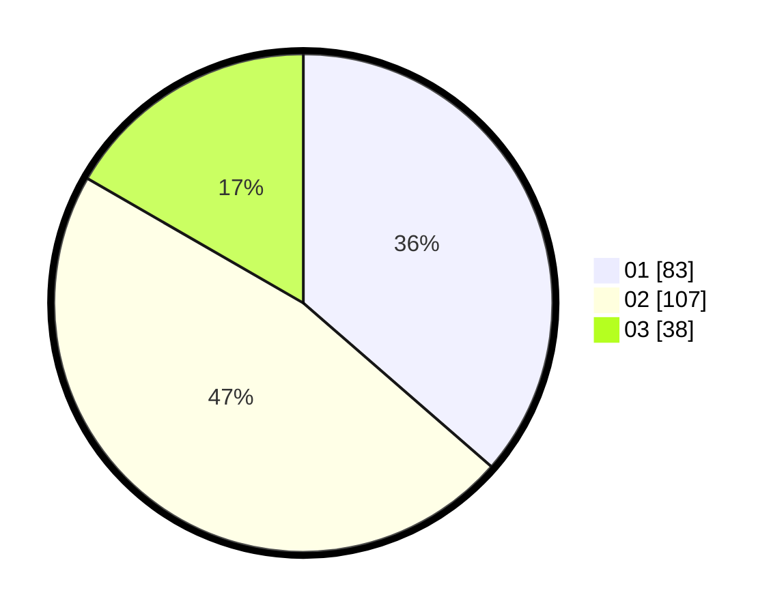

# Hasil

Hasil perolehan suara paslon dapat dilihat pada file paslon-01.txt, paslon-02.txt, dan paslon-03.txt.

Jika tidak ada, artinya data tersebut belum ada pada SIREKAP.

## Perolehan Suara

 * Paslon 01: **83**.
 * Paslon 02: **107**.
 * Paslon 03: **38**.

## Foto C Plano

https://sirekap-obj-formc.kpu.go.id/2851/pemilu/ppwp/31/01/01/10/01/3101011001001-20240214-205639--4f9bafd8-1602-4579-9588-bf8bf3d6c285.jpg

https://sirekap-obj-formc.kpu.go.id/2851/pemilu/ppwp/31/01/01/10/01/3101011001001-20240216-135709--fbcf92f8-6da6-48f9-806c-abb1ba17b013.jpg

https://sirekap-obj-formc.kpu.go.id/2851/pemilu/ppwp/31/01/01/10/01/3101011001001-20240214-205701--8d3291c9-f10b-4737-8459-138e013a85a8.jpg

## DATA PEMILIH TETAP

Jumlah pemilih dalam DPT: **292**.
 * L: **147**.
 * P: **145**.

## DATA PENGGUNA HAK PILIH

Jumlah pengguna hak pilih dalam DPT: **292**.
 * L: **147**.
 * P: **145**.

Jumlah pengguna hak pilih dalam DPTb: **1**.
 * L: **0**.
 * P: **1**.

Jumlah pengguna hak pilih dalam DPK: **0**.
 * L: **0**.
 * P: **0**.

Jumlah pengguna hak pilih: **292**.
 * L: **147**.
 * P: **145**.

## JUMLAH SUARA SAH DAN TIDAK SAH

JUMLAH SELURUH SUARA SAH: **228**.

JUMLAH SUARA TIDAK SAH: **5**.

JUMLAH SELURUH SUARA SAH DAN SUARA TIDAK SAH: **233**.
