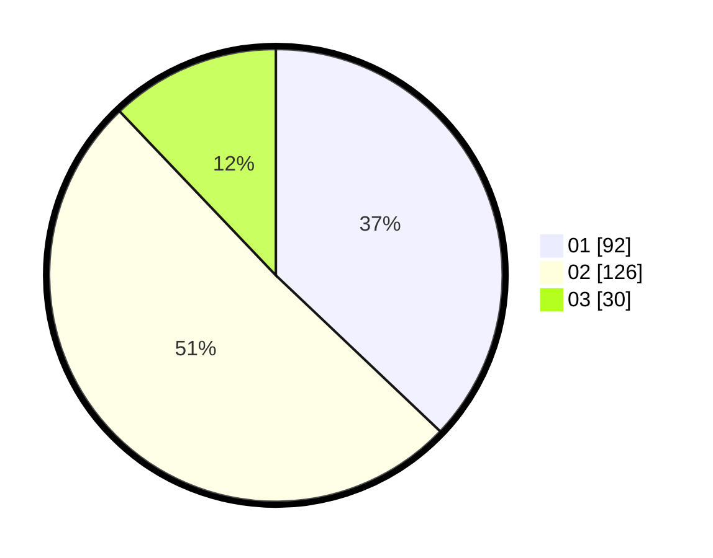

# Hasil

Hasil perolehan suara paslon dapat dilihat pada file paslon-01.txt, paslon-02.txt, dan paslon-03.txt.

Jika tidak ada, artinya data tersebut belum ada pada SIREKAP.

## Perolehan Suara

 * Paslon 01: **92**.
 * Paslon 02: **126**.
 * Paslon 03: **30**.

## Foto C Plano

https://sirekap-obj-formc.kpu.go.id/bb29/pemilu/ppwp/31/01/01/10/01/3101011001002-20240216-115245--8ad6a162-c238-4435-bca4-a828b24642d3.jpg

https://sirekap-obj-formc.kpu.go.id/bb29/pemilu/ppwp/31/01/01/10/01/3101011001002-20240216-115248--21a1e8d6-e24d-4197-844d-ef0d8a348308.jpg

https://sirekap-obj-formc.kpu.go.id/bb29/pemilu/ppwp/31/01/01/10/01/3101011001002-20240216-115246--513688af-64c3-4da7-a81c-6af4401c52e7.jpg

## DATA PEMILIH TETAP

Jumlah pemilih dalam DPT: **285**.
 * L: **144**.
 * P: **141**.

## DATA PENGGUNA HAK PILIH

Jumlah pengguna hak pilih dalam DPT: **251**.
 * L: **122**.
 * P: **129**.

Jumlah pengguna hak pilih dalam DPTb: **0**.
 * L: **0**.
 * P: **0**.

Jumlah pengguna hak pilih dalam DPK: **4**.
 * L: **2**.
 * P: **2**.

Jumlah pengguna hak pilih: **255**.
 * L: **124**.
 * P: **131**.

## JUMLAH SUARA SAH DAN TIDAK SAH

JUMLAH SELURUH SUARA SAH: **248**.

JUMLAH SUARA TIDAK SAH: **7**.

JUMLAH SELURUH SUARA SAH DAN SUARA TIDAK SAH: **255**.
