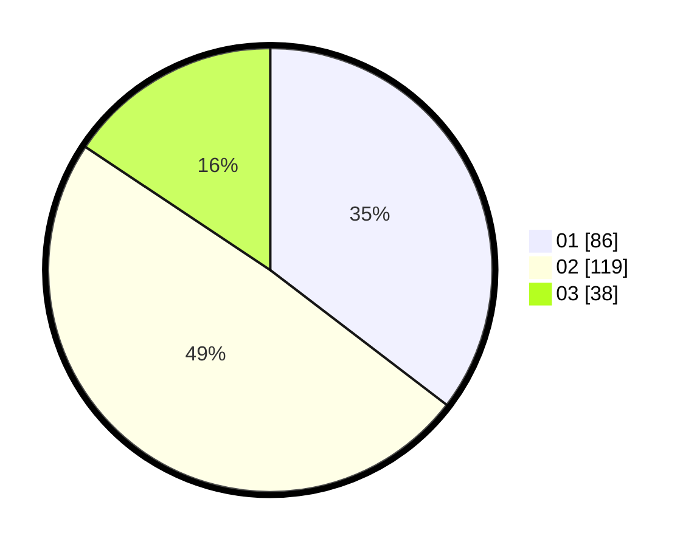

# Hasil

Hasil perolehan suara paslon dapat dilihat pada file paslon-01.txt, paslon-02.txt, dan paslon-03.txt.

Jika tidak ada, artinya data tersebut belum ada pada SIREKAP.

## Perolehan Suara

 * Paslon 01: **86**.
 * Paslon 02: **119**.
 * Paslon 03: **38**.

## Foto C Plano

https://sirekap-obj-formc.kpu.go.id/8de9/pemilu/ppwp/31/01/01/10/01/3101011001003-20240215-002006--faf26c88-f35d-4375-a5ad-99cc9c11b54f.jpg

https://sirekap-obj-formc.kpu.go.id/8de9/pemilu/ppwp/31/01/01/10/01/3101011001003-20240216-133822--5e1c2280-3a86-47c5-a2d9-5b89cc312eed.jpg

https://sirekap-obj-formc.kpu.go.id/8de9/pemilu/ppwp/31/01/01/10/01/3101011001003-20240216-133822--9cea8c5b-63ee-4254-9af9-ba2121e48d82.jpg

## DATA PEMILIH TETAP

Jumlah pemilih dalam DPT: **282**.
 * L: **137**.
 * P: **145**.

## DATA PENGGUNA HAK PILIH

Jumlah pengguna hak pilih dalam DPT: **237**.
 * L: **116**.
 * P: **126**.

Jumlah pengguna hak pilih dalam DPTb: **1**.
 * L: **0**.
 * P: **1**.

Jumlah pengguna hak pilih dalam DPK: **0**.
 * L: **0**.
 * P: **0**.

Jumlah pengguna hak pilih: **238**.
 * L: **116**.
 * P: **122**.

## JUMLAH SUARA SAH DAN TIDAK SAH

JUMLAH SELURUH SUARA SAH: **235**.

JUMLAH SUARA TIDAK SAH: **3**.

JUMLAH SELURUH SUARA SAH DAN SUARA TIDAK SAH: **238**.
