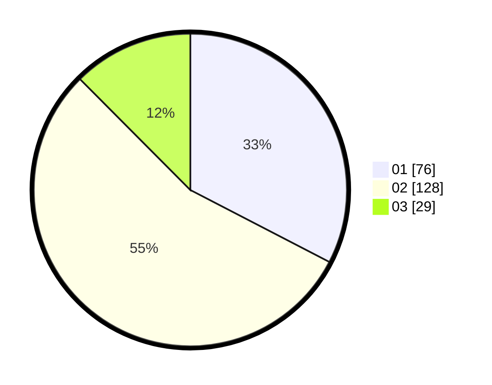

# Hasil

Hasil perolehan suara paslon dapat dilihat pada file paslon-01.txt, paslon-02.txt, dan paslon-03.txt.

Jika tidak ada, artinya data tersebut belum ada pada SIREKAP.

## Perolehan Suara

 * Paslon 01: **76**.
 * Paslon 02: **128**.
 * Paslon 03: **29**.

## Foto C Plano

https://sirekap-obj-formc.kpu.go.id/955c/pemilu/ppwp/31/01/01/10/01/3101011001005-20240214-200809--4027949d-5a6c-4cf8-8e07-4894b8e1e039.jpg

https://sirekap-obj-formc.kpu.go.id/955c/pemilu/ppwp/31/01/01/10/01/3101011001005-20240214-200945--555bde25-2953-4d29-a86c-029bd5a70fdf.jpg

https://sirekap-obj-formc.kpu.go.id/955c/pemilu/ppwp/31/01/01/10/01/3101011001005-20240214-201054--e234e8d4-2c99-4de2-8f7f-b67f7e7bb7c4.jpg

## DATA PEMILIH TETAP

Jumlah pemilih dalam DPT: **288**.
 * L: **144**.
 * P: **144**.

## DATA PENGGUNA HAK PILIH

Jumlah pengguna hak pilih dalam DPT: **223**.
 * L: **110**.
 * P: **113**.

Jumlah pengguna hak pilih dalam DPTb: **12**.
 * L: **11**.
 * P: **1**.

Jumlah pengguna hak pilih dalam DPK: **0**.
 * L: **0**.
 * P: **0**.

Jumlah pengguna hak pilih: **235**.
 * L: **121**.
 * P: **114**.

## JUMLAH SUARA SAH DAN TIDAK SAH

JUMLAH SELURUH SUARA SAH: **233**.

JUMLAH SUARA TIDAK SAH: **2**.

JUMLAH SELURUH SUARA SAH DAN SUARA TIDAK SAH: **235**.
