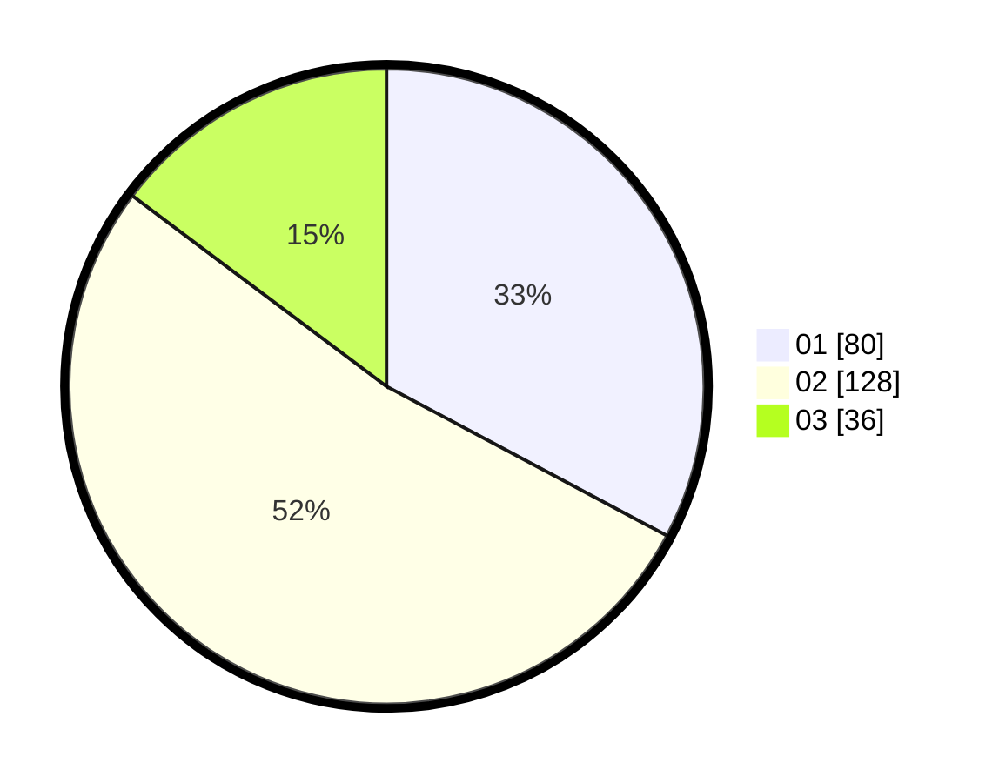

# Hasil

Hasil perolehan suara paslon dapat dilihat pada file paslon-01.txt, paslon-02.txt, dan paslon-03.txt.

Jika tidak ada, artinya data tersebut belum ada pada SIREKAP.

## Perolehan Suara

 * Paslon 01: **80**.
 * Paslon 02: **128**.
 * Paslon 03: **36**.

## Foto C Plano

https://sirekap-obj-formc.kpu.go.id/87e6/pemilu/ppwp/31/01/01/10/01/3101011001015-20240214-193823--f70ca984-d09e-4ab2-a1c0-22ea27f9064e.jpg

https://sirekap-obj-formc.kpu.go.id/87e6/pemilu/ppwp/31/01/01/10/01/3101011001015-20240216-122754--ba9bbfd0-22bd-4f9b-8104-dfc0d7468300.jpg

https://sirekap-obj-formc.kpu.go.id/87e6/pemilu/ppwp/31/01/01/10/01/3101011001015-20240214-194620--2cfe6869-ed3c-4de8-83ed-f117e670a93e.jpg

## DATA PEMILIH TETAP

Jumlah pemilih dalam DPT: **293**.
 * L: **144**.
 * P: **149**.

## DATA PENGGUNA HAK PILIH

Jumlah pengguna hak pilih dalam DPT: **246**.
 * L: **121**.
 * P: **125**.

Jumlah pengguna hak pilih dalam DPTb: **1**.
 * L: **0**.
 * P: **1**.

Jumlah pengguna hak pilih dalam DPK: **2**.
 * L: **1**.
 * P: **1**.

Jumlah pengguna hak pilih: **249**.
 * L: **122**.
 * P: **127**.

## JUMLAH SUARA SAH DAN TIDAK SAH

JUMLAH SELURUH SUARA SAH: **244**.

JUMLAH SUARA TIDAK SAH: **5**.

JUMLAH SELURUH SUARA SAH DAN SUARA TIDAK SAH: **249**.
