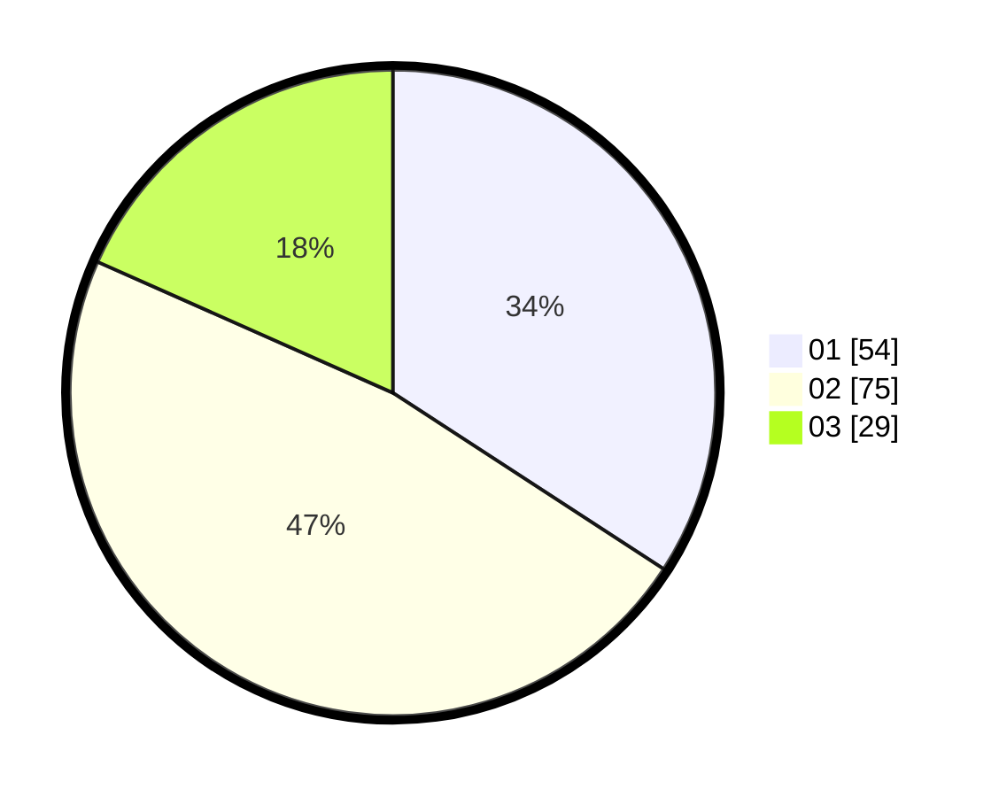

# Hasil

Hasil perolehan suara paslon dapat dilihat pada file paslon-01.txt, paslon-02.txt, dan paslon-03.txt.

Jika tidak ada, artinya data tersebut belum ada pada SIREKAP.

## Perolehan Suara

 * Paslon 01: **54**.
 * Paslon 02: **75**.
 * Paslon 03: **29**.

## Foto C Plano

https://sirekap-obj-formc.kpu.go.id/0060/pemilu/ppwp/31/01/01/10/01/3101011001018-20240216-132159--8f0baad8-484a-4bd6-9f71-cae8ad967c19.jpg

https://sirekap-obj-formc.kpu.go.id/0060/pemilu/ppwp/31/01/01/10/01/3101011001018-20240216-132200--72288f82-5c69-4817-99ad-005e30f65ee0.jpg

https://sirekap-obj-formc.kpu.go.id/0060/pemilu/ppwp/31/01/01/10/01/3101011001018-20240216-132200--5be5f008-3158-4eb1-abbc-e38c4a137639.jpg

## DATA PEMILIH TETAP

Jumlah pemilih dalam DPT: **198**.
 * L: **97**.
 * P: **101**.

## DATA PENGGUNA HAK PILIH

Jumlah pengguna hak pilih dalam DPT: **154**.
 * L: **69**.
 * P: **85**.

Jumlah pengguna hak pilih dalam DPTb: **8**.
 * L: **3**.
 * P: **5**.

Jumlah pengguna hak pilih dalam DPK: **0**.
 * L: **0**.
 * P: **0**.

Jumlah pengguna hak pilih: **162**.
 * L: **72**.
 * P: **90**.

## JUMLAH SUARA SAH DAN TIDAK SAH

JUMLAH SELURUH SUARA SAH: **158**.

JUMLAH SUARA TIDAK SAH: **4**.

JUMLAH SELURUH SUARA SAH DAN SUARA TIDAK SAH: **162**.
