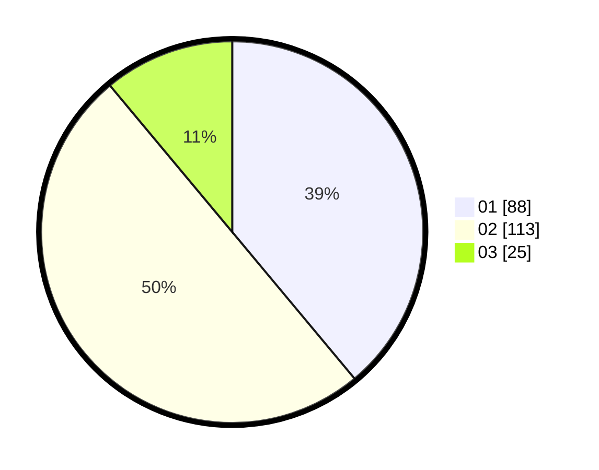

# Hasil

Hasil perolehan suara paslon dapat dilihat pada file paslon-01.txt, paslon-02.txt, dan paslon-03.txt.

Jika tidak ada, artinya data tersebut belum ada pada SIREKAP.

## Perolehan Suara

 * Paslon 01: **88**.
 * Paslon 02: **113**.
 * Paslon 03: **25**.

## Foto C Plano

https://sirekap-obj-formc.kpu.go.id/84a6/pemilu/ppwp/31/01/01/10/02/3101011002006-20240218-124021--e4a851fa-2237-468d-ba34-9dbaf449a494.jpg

https://sirekap-obj-formc.kpu.go.id/84a6/pemilu/ppwp/31/01/01/10/02/3101011002006-20240218-124022--74c3ae80-9157-43b5-aca2-a8ac1e0649df.jpg

https://sirekap-obj-formc.kpu.go.id/84a6/pemilu/ppwp/31/01/01/10/02/3101011002006-20240215-000108--9e911c0d-4f48-4911-80a7-171e9491f5d0.jpg

## DATA PEMILIH TETAP

Jumlah pemilih dalam DPT: **284**.
 * L: **137**.
 * P: **147**.

## DATA PENGGUNA HAK PILIH

Jumlah pengguna hak pilih dalam DPT: **221**.
 * L: **99**.
 * P: **122**.

Jumlah pengguna hak pilih dalam DPTb: **4**.
 * L: **3**.
 * P: **1**.

Jumlah pengguna hak pilih dalam DPK: **3**.
 * L: **2**.
 * P: **1**.

Jumlah pengguna hak pilih: **228**.
 * L: **104**.
 * P: **124**.

## JUMLAH SUARA SAH DAN TIDAK SAH

JUMLAH SELURUH SUARA SAH: **226**.

JUMLAH SUARA TIDAK SAH: **2**.

JUMLAH SELURUH SUARA SAH DAN SUARA TIDAK SAH: **228**.
