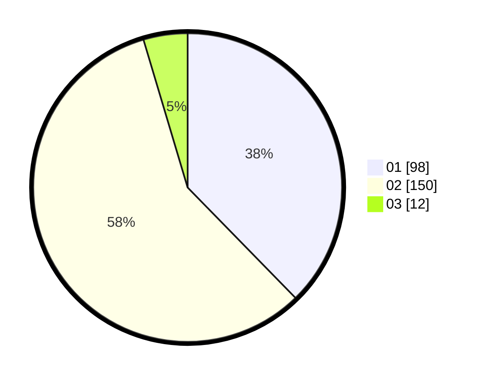

# Hasil

Hasil perolehan suara paslon dapat dilihat pada file paslon-01.txt, paslon-02.txt, dan paslon-03.txt.

Jika tidak ada, artinya data tersebut belum ada pada SIREKAP.

## Perolehan Suara

 * Paslon 01: **98**.
 * Paslon 02: **150**.
 * Paslon 03: **12**.

## Foto C Plano

https://sirekap-obj-formc.kpu.go.id/0da8/pemilu/ppwp/31/01/01/10/02/3101011002008-20240215-054515--06c54d61-23ad-4deb-8912-8c822bd75e74.jpg

https://sirekap-obj-formc.kpu.go.id/0da8/pemilu/ppwp/31/01/01/10/02/3101011002008-20240215-054614--27ba4a21-78bd-4d5f-bd08-455593b62ac4.jpg

https://sirekap-obj-formc.kpu.go.id/0da8/pemilu/ppwp/31/01/01/10/02/3101011002008-20240215-054736--5dc4f63a-bf74-4bd2-809e-6505ee10ff84.jpg

## DATA PEMILIH TETAP

Jumlah pemilih dalam DPT: **289**.
 * L: **150**.
 * P: **139**.

## DATA PENGGUNA HAK PILIH

Jumlah pengguna hak pilih dalam DPT: **249**.
 * L: **125**.
 * P: **124**.

Jumlah pengguna hak pilih dalam DPTb: **14**.
 * L: **12**.
 * P: **2**.

Jumlah pengguna hak pilih dalam DPK: **2**.
 * L: **1**.
 * P: **1**.

Jumlah pengguna hak pilih: **265**.
 * L: **138**.
 * P: **127**.

## JUMLAH SUARA SAH DAN TIDAK SAH

JUMLAH SELURUH SUARA SAH: **260**.

JUMLAH SUARA TIDAK SAH: **5**.

JUMLAH SELURUH SUARA SAH DAN SUARA TIDAK SAH: **265**.
