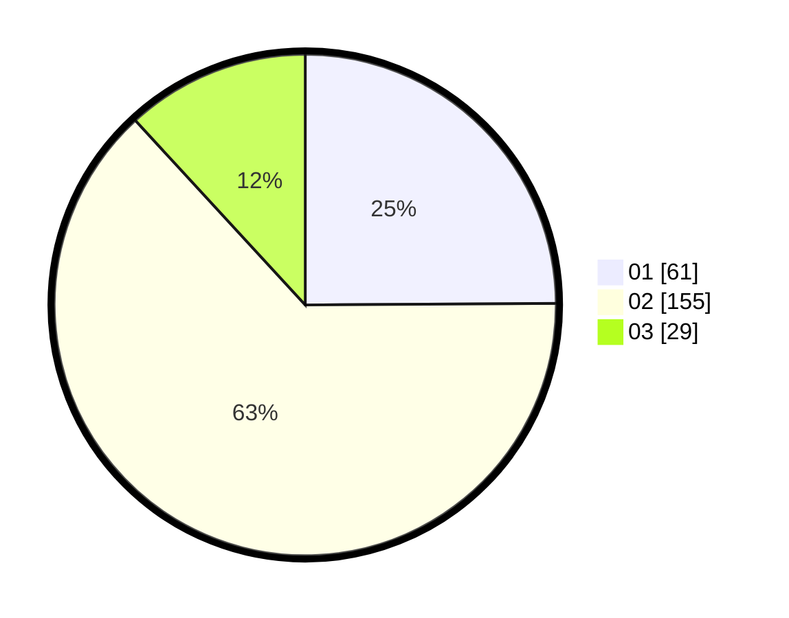

# Hasil

Hasil perolehan suara paslon dapat dilihat pada file paslon-01.txt, paslon-02.txt, dan paslon-03.txt.

Jika tidak ada, artinya data tersebut belum ada pada SIREKAP.

## Perolehan Suara

 * Paslon 01: **61**.
 * Paslon 02: **155**.
 * Paslon 03: **29**.

## Foto C Plano

https://sirekap-obj-formc.kpu.go.id/57ac/pemilu/ppwp/31/01/01/10/02/3101011002010-20240214-193804--0a103a79-b5f6-43fe-845c-d15bd560831f.jpg

https://sirekap-obj-formc.kpu.go.id/57ac/pemilu/ppwp/31/01/01/10/02/3101011002010-20240214-193858--d866441d-5949-4cdc-baf6-97defb0344a6.jpg

https://sirekap-obj-formc.kpu.go.id/57ac/pemilu/ppwp/31/01/01/10/02/3101011002010-20240214-203955--01390837-9cd4-42b1-bbc8-67c52efe1056.jpg

## DATA PEMILIH TETAP

Jumlah pemilih dalam DPT: **289**.
 * L: **137**.
 * P: **152**.

## DATA PENGGUNA HAK PILIH

Jumlah pengguna hak pilih dalam DPT: **233**.
 * L: **104**.
 * P: **129**.

Jumlah pengguna hak pilih dalam DPTb: **12**.
 * L: **11**.
 * P: **1**.

Jumlah pengguna hak pilih dalam DPK: **3**.
 * L: **1**.
 * P: **2**.

Jumlah pengguna hak pilih: **248**.
 * L: **116**.
 * P: **132**.

## JUMLAH SUARA SAH DAN TIDAK SAH

JUMLAH SELURUH SUARA SAH: **245**.

JUMLAH SUARA TIDAK SAH: **3**.

JUMLAH SELURUH SUARA SAH DAN SUARA TIDAK SAH: **248**.
