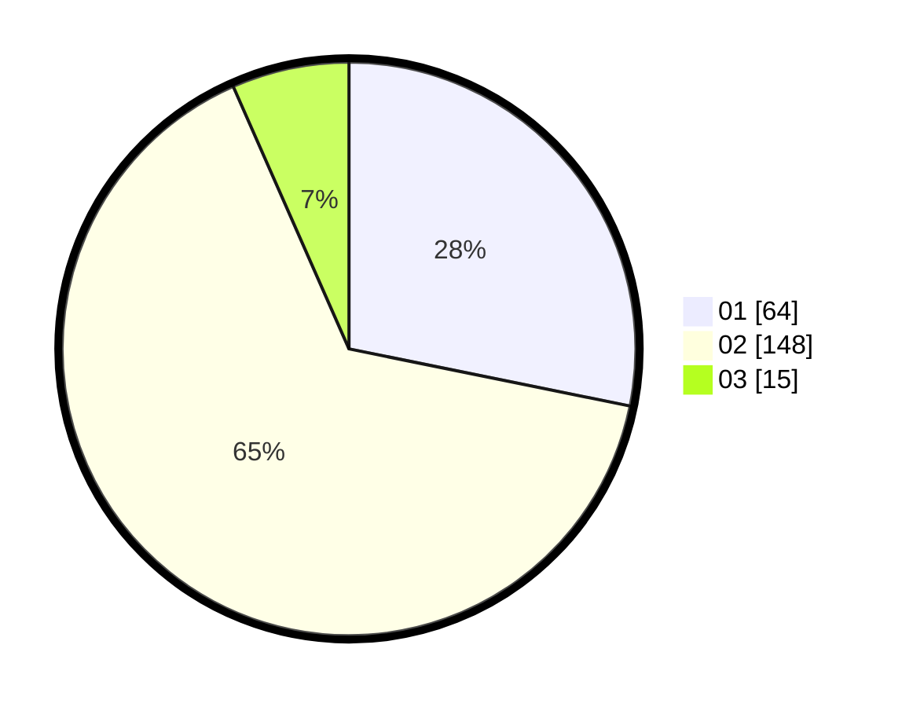

# Hasil

Hasil perolehan suara paslon dapat dilihat pada file paslon-01.txt, paslon-02.txt, dan paslon-03.txt.

Jika tidak ada, artinya data tersebut belum ada pada SIREKAP.

## Perolehan Suara

 * Paslon 01: **64**.
 * Paslon 02: **148**.
 * Paslon 03: **15**.

## Foto C Plano

https://sirekap-obj-formc.kpu.go.id/c1be/pemilu/ppwp/31/01/01/10/02/3101011002011-20240217-171108--c3410b41-e2cf-4103-b629-90838663075f.jpg

https://sirekap-obj-formc.kpu.go.id/c1be/pemilu/ppwp/31/01/01/10/02/3101011002011-20240217-171109--a668d4cc-9c13-4887-a7b8-92cea30f9548.jpg

https://sirekap-obj-formc.kpu.go.id/c1be/pemilu/ppwp/31/01/01/10/02/3101011002011-20240217-171108--ea4f0947-be4b-43e3-ad1d-d9dcb084adff.jpg

## DATA PEMILIH TETAP

Jumlah pemilih dalam DPT: **280**.
 * L: **135**.
 * P: **145**.

## DATA PENGGUNA HAK PILIH

Jumlah pengguna hak pilih dalam DPT: **225**.
 * L: **103**.
 * P: **122**.

Jumlah pengguna hak pilih dalam DPTb: **8**.
 * L: **8**.
 * P: **0**.

Jumlah pengguna hak pilih dalam DPK: **1**.
 * L: **0**.
 * P: **1**.

Jumlah pengguna hak pilih: **234**.
 * L: **111**.
 * P: **123**.

## JUMLAH SUARA SAH DAN TIDAK SAH

JUMLAH SELURUH SUARA SAH: **227**.

JUMLAH SUARA TIDAK SAH: **7**.

JUMLAH SELURUH SUARA SAH DAN SUARA TIDAK SAH: **234**.
