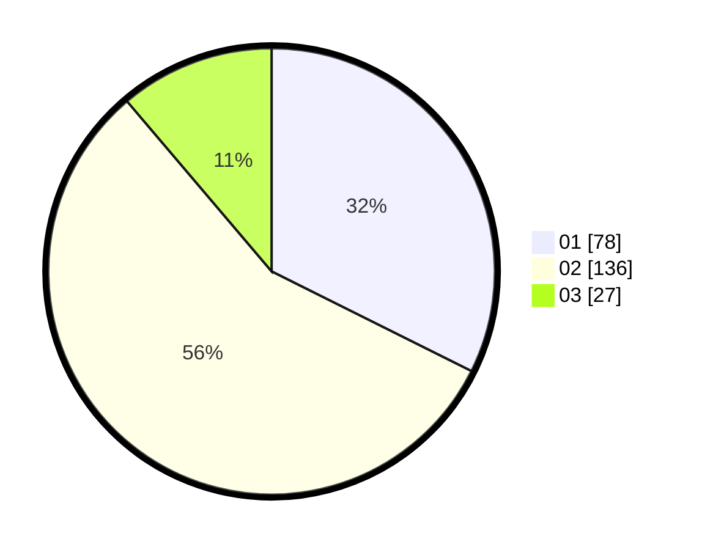

# Hasil

Hasil perolehan suara paslon dapat dilihat pada file paslon-01.txt, paslon-02.txt, dan paslon-03.txt.

Jika tidak ada, artinya data tersebut belum ada pada SIREKAP.

## Perolehan Suara

 * Paslon 01: **78**.
 * Paslon 02: **136**.
 * Paslon 03: **27**.

## Foto C Plano

https://sirekap-obj-formc.kpu.go.id/04e1/pemilu/ppwp/31/01/01/10/02/3101011002012-20240215-000336--4d8d7b16-e172-485f-952b-aa749f083815.jpg

https://sirekap-obj-formc.kpu.go.id/04e1/pemilu/ppwp/31/01/01/10/02/3101011002012-20240215-003427--5972b08b-8e94-49a9-b60a-bfe96c05f701.jpg

https://sirekap-obj-formc.kpu.go.id/04e1/pemilu/ppwp/31/01/01/10/02/3101011002012-20240215-003713--6b4feabe-3bc1-4ebf-a5f5-78486810f5b6.jpg

## DATA PEMILIH TETAP

Jumlah pemilih dalam DPT: **288**.
 * L: **147**.
 * P: **141**.

## DATA PENGGUNA HAK PILIH

Jumlah pengguna hak pilih dalam DPT: **226**.
 * L: **112**.
 * P: **114**.

Jumlah pengguna hak pilih dalam DPTb: **18**.
 * L: **12**.
 * P: **1**.

Jumlah pengguna hak pilih dalam DPK: **2**.
 * L: **1**.
 * P: **1**.

Jumlah pengguna hak pilih: **246**.
 * L: **130**.
 * P: **116**.

## JUMLAH SUARA SAH DAN TIDAK SAH

JUMLAH SELURUH SUARA SAH: **241**.

JUMLAH SUARA TIDAK SAH: **5**.

JUMLAH SELURUH SUARA SAH DAN SUARA TIDAK SAH: **246**.
