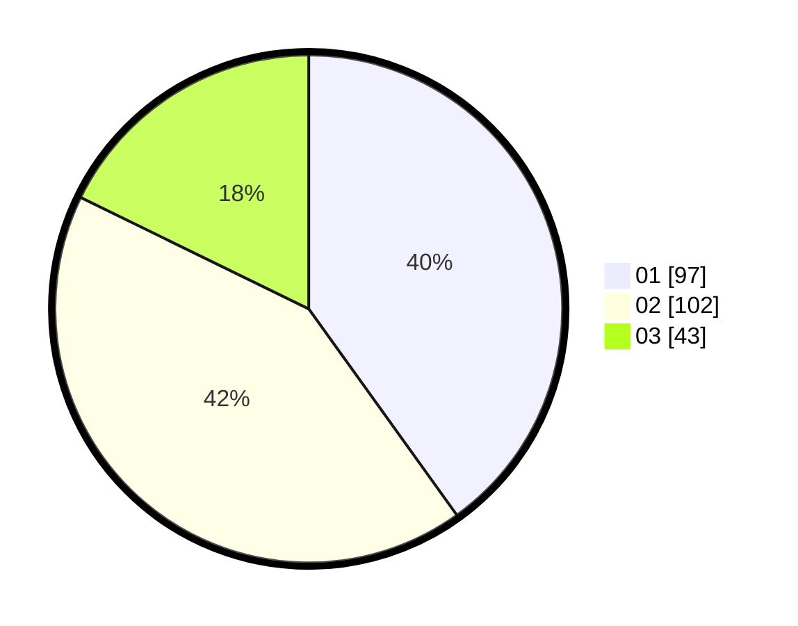

# Hasil

Hasil perolehan suara paslon dapat dilihat pada file paslon-01.txt, paslon-02.txt, dan paslon-03.txt.

Jika tidak ada, artinya data tersebut belum ada pada SIREKAP.

## Perolehan Suara

 * Paslon 01: **97**.
 * Paslon 02: **102**.
 * Paslon 03: **43**.

## Foto C Plano

https://sirekap-obj-formc.kpu.go.id/d672/pemilu/ppwp/31/01/01/10/02/3101011002013-20240216-055232--e5d332a8-2df7-4d99-9c06-133eafe7ad79.jpg

https://sirekap-obj-formc.kpu.go.id/d672/pemilu/ppwp/31/01/01/10/02/3101011002013-20240216-055234--30941c59-0a60-4cf4-bb6e-ed36e5f80e2a.jpg

https://sirekap-obj-formc.kpu.go.id/d672/pemilu/ppwp/31/01/01/10/02/3101011002013-20240216-055233--59ec044a-f91d-463a-b3f3-336fb89e4197.jpg

## DATA PEMILIH TETAP

Jumlah pemilih dalam DPT: **288**.
 * L: **147**.
 * P: **141**.

## DATA PENGGUNA HAK PILIH

Jumlah pengguna hak pilih dalam DPT: **237**.
 * L: **114**.
 * P: **123**.

Jumlah pengguna hak pilih dalam DPTb: **6**.
 * L: **4**.
 * P: **2**.

Jumlah pengguna hak pilih dalam DPK: **0**.
 * L: **0**.
 * P: **0**.

Jumlah pengguna hak pilih: **243**.
 * L: **118**.
 * P: **125**.

## JUMLAH SUARA SAH DAN TIDAK SAH

JUMLAH SELURUH SUARA SAH: **242**.

JUMLAH SUARA TIDAK SAH: **1**.

JUMLAH SELURUH SUARA SAH DAN SUARA TIDAK SAH: **243**.
