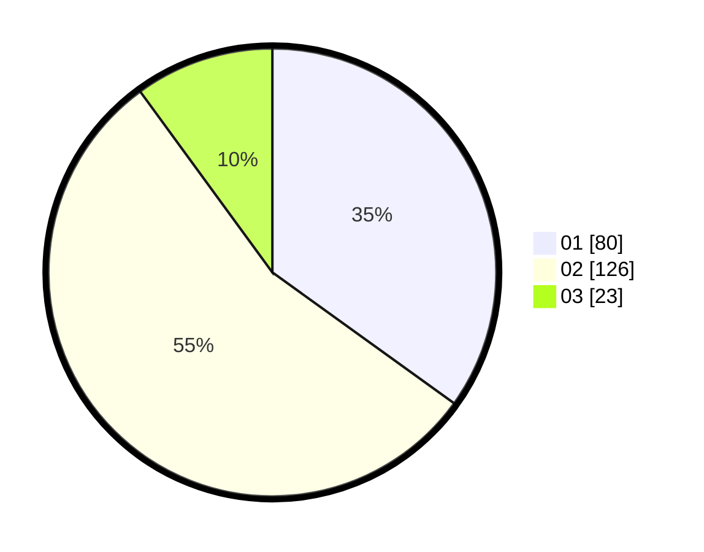

# Hasil

Hasil perolehan suara paslon dapat dilihat pada file paslon-01.txt, paslon-02.txt, dan paslon-03.txt.

Jika tidak ada, artinya data tersebut belum ada pada SIREKAP.

## Perolehan Suara

 * Paslon 01: **80**.
 * Paslon 02: **126**.
 * Paslon 03: **23**.

## Foto C Plano

https://sirekap-obj-formc.kpu.go.id/3444/pemilu/ppwp/31/01/01/10/02/3101011002014-20240218-110700--23d3aa1f-5774-4377-bcd3-56676fb843cd.jpg

https://sirekap-obj-formc.kpu.go.id/3444/pemilu/ppwp/31/01/01/10/02/3101011002014-20240214-232653--d3dc2421-e56a-4cc2-914a-f7e796a2f16a.jpg

https://sirekap-obj-formc.kpu.go.id/3444/pemilu/ppwp/31/01/01/10/02/3101011002014-20240214-232809--f80a4032-1996-4fb1-b125-c9c396caf5d2.jpg
