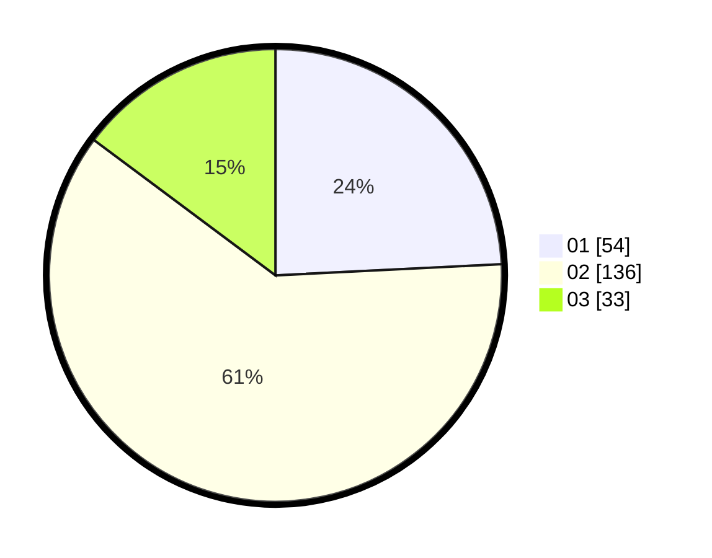

# Hasil

Hasil perolehan suara paslon dapat dilihat pada file paslon-01.txt, paslon-02.txt, dan paslon-03.txt.

Jika tidak ada, artinya data tersebut belum ada pada SIREKAP.

## Perolehan Suara

 * Paslon 01: **54**.
 * Paslon 02: **136**.
 * Paslon 03: **33**.

## Foto C Plano

https://sirekap-obj-formc.kpu.go.id/a47b/pemilu/ppwp/31/01/01/10/02/3101011002015-20240214-210713--fd2ddbf4-942f-429e-8172-618e94555f27.jpg

https://sirekap-obj-formc.kpu.go.id/a47b/pemilu/ppwp/31/01/01/10/02/3101011002015-20240215-033348--ca70cf11-5a01-4792-979e-159dcae4f2b6.jpg

https://sirekap-obj-formc.kpu.go.id/a47b/pemilu/ppwp/31/01/01/10/02/3101011002015-20240214-211956--c6d9e618-f85f-45aa-8e57-3c50b64f8016.jpg

## DATA PEMILIH TETAP

Jumlah pemilih dalam DPT: **288**.
 * L: **142**.
 * P: **146**.

## DATA PENGGUNA HAK PILIH

Jumlah pengguna hak pilih dalam DPT: **217**.
 * L: **104**.
 * P: **113**.

Jumlah pengguna hak pilih dalam DPTb: **9**.
 * L: **5**.
 * P: **4**.

Jumlah pengguna hak pilih dalam DPK: **1**.
 * L: **0**.
 * P: **1**.

Jumlah pengguna hak pilih: **227**.
 * L: **109**.
 * P: **118**.

## JUMLAH SUARA SAH DAN TIDAK SAH

JUMLAH SELURUH SUARA SAH: **223**.

JUMLAH SUARA TIDAK SAH: **4**.

JUMLAH SELURUH SUARA SAH DAN SUARA TIDAK SAH: **227**.
