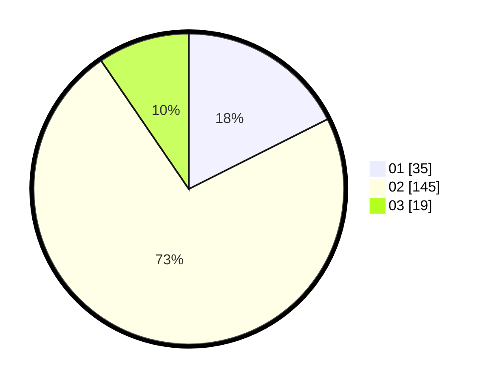

# Hasil

Hasil perolehan suara paslon dapat dilihat pada file paslon-01.txt, paslon-02.txt, dan paslon-03.txt.

Jika tidak ada, artinya data tersebut belum ada pada SIREKAP.

## Perolehan Suara

 * Paslon 01: **35**.
 * Paslon 02: **145**.
 * Paslon 03: **19**.

## Foto C Plano

https://sirekap-obj-formc.kpu.go.id/b3b2/pemilu/ppwp/31/01/01/10/02/3101011002016-20240216-110101--f67f1351-a25c-410c-8471-780846751c80.jpg

https://sirekap-obj-formc.kpu.go.id/b3b2/pemilu/ppwp/31/01/01/10/02/3101011002016-20240216-110103--14651281-1422-4f1a-b667-5053c446f464.jpg

https://sirekap-obj-formc.kpu.go.id/b3b2/pemilu/ppwp/31/01/01/10/02/3101011002016-20240216-110102--577b04bd-1481-4848-97e7-9cacf29acc36.jpg

## DATA PEMILIH TETAP

Jumlah pemilih dalam DPT: **248**.
 * L: **122**.
 * P: **126**.

## DATA PENGGUNA HAK PILIH

Jumlah pengguna hak pilih dalam DPT: **248**.
 * L: **122**.
 * P: **126**.

Jumlah pengguna hak pilih dalam DPTb: **12**.
 * L: **11**.
 * P: **1**.

Jumlah pengguna hak pilih dalam DPK: **3**.
 * L: **0**.
 * P: **3**.

Jumlah pengguna hak pilih: **263**.
 * L: **133**.
 * P: **130**.

## JUMLAH SUARA SAH DAN TIDAK SAH

JUMLAH SELURUH SUARA SAH: **199**.

JUMLAH SUARA TIDAK SAH: **2**.

JUMLAH SELURUH SUARA SAH DAN SUARA TIDAK SAH: **201**.
