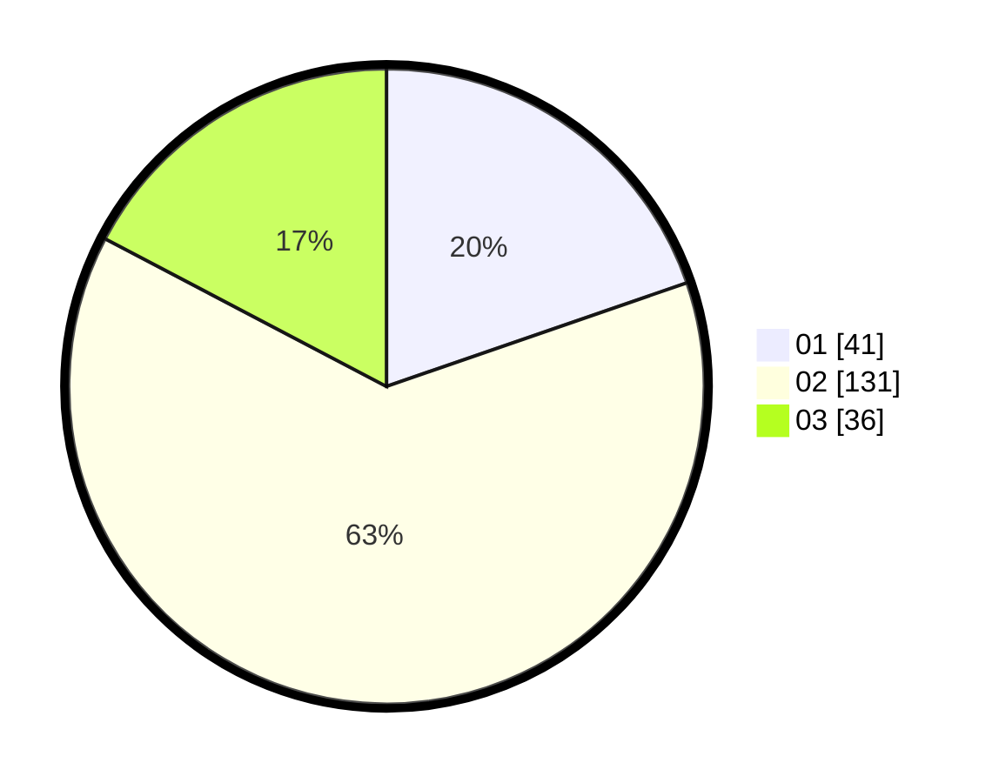

# Hasil

Hasil perolehan suara paslon dapat dilihat pada file paslon-01.txt, paslon-02.txt, dan paslon-03.txt.

Jika tidak ada, artinya data tersebut belum ada pada SIREKAP.

## Perolehan Suara

 * Paslon 01: **41**.
 * Paslon 02: **131**.
 * Paslon 03: **36**.

## Foto C Plano

https://sirekap-obj-formc.kpu.go.id/6a37/pemilu/ppwp/31/01/01/10/02/3101011002017-20240215-001758--d279865e-ec4a-4e27-babf-15e6649ed884.jpg

https://sirekap-obj-formc.kpu.go.id/6a37/pemilu/ppwp/31/01/01/10/02/3101011002017-20240215-001933--30e17719-690a-42b2-bf99-de125a523624.jpg

https://sirekap-obj-formc.kpu.go.id/6a37/pemilu/ppwp/31/01/01/10/02/3101011002017-20240215-003752--6c460adf-f3f6-40fb-8fc9-1a30c8823036.jpg

## DATA PEMILIH TETAP

Jumlah pemilih dalam DPT: **244**.
 * L: **127**.
 * P: **117**.

## DATA PENGGUNA HAK PILIH

Jumlah pengguna hak pilih dalam DPT: **244**.
 * L: **127**.
 * P: **117**.

Jumlah pengguna hak pilih dalam DPTb: **10**.
 * L: **10**.
 * P: **0**.

Jumlah pengguna hak pilih dalam DPK: **3**.
 * L: **1**.
 * P: **2**.

Jumlah pengguna hak pilih: **257**.
 * L: **138**.
 * P: **119**.

## JUMLAH SUARA SAH DAN TIDAK SAH

JUMLAH SELURUH SUARA SAH: **208**.

JUMLAH SUARA TIDAK SAH: **4**.

JUMLAH SELURUH SUARA SAH DAN SUARA TIDAK SAH: **212**.
