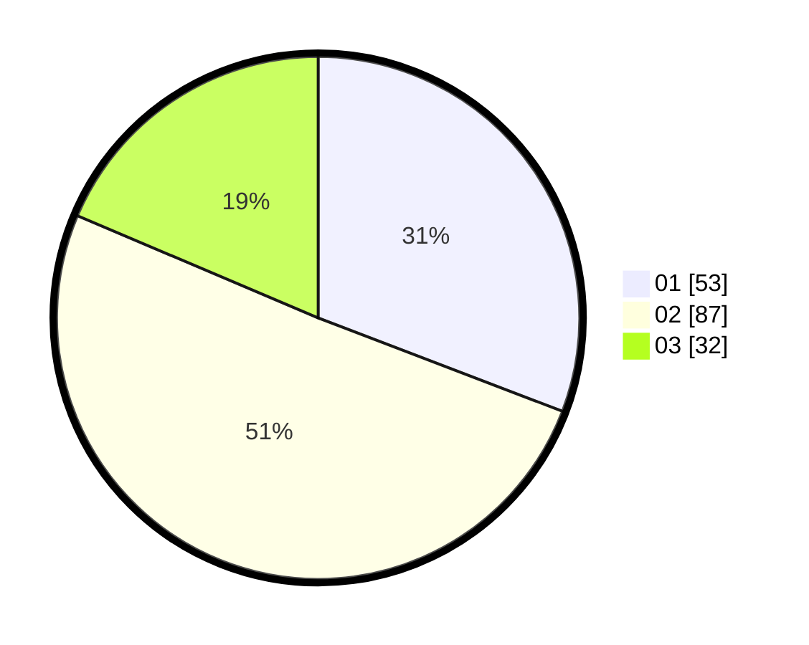

# Hasil

Hasil perolehan suara paslon dapat dilihat pada file paslon-01.txt, paslon-02.txt, dan paslon-03.txt.

Jika tidak ada, artinya data tersebut belum ada pada SIREKAP.

## Perolehan Suara

 * Paslon 01: **53**.
 * Paslon 02: **87**.
 * Paslon 03: **32**.

## Foto C Plano

https://sirekap-obj-formc.kpu.go.id/6114/pemilu/ppwp/31/01/01/10/02/3101011002019-20240215-022929--feba91f8-136d-480c-912d-8805bcc0ef4f.jpg

https://sirekap-obj-formc.kpu.go.id/6114/pemilu/ppwp/31/01/01/10/02/3101011002019-20240214-210318--7a571276-193a-442f-84f9-2bcea72511ff.jpg

https://sirekap-obj-formc.kpu.go.id/6114/pemilu/ppwp/31/01/01/10/02/3101011002019-20240214-210404--fbbb1b25-aba2-45f4-8a10-0f90a9271548.jpg
