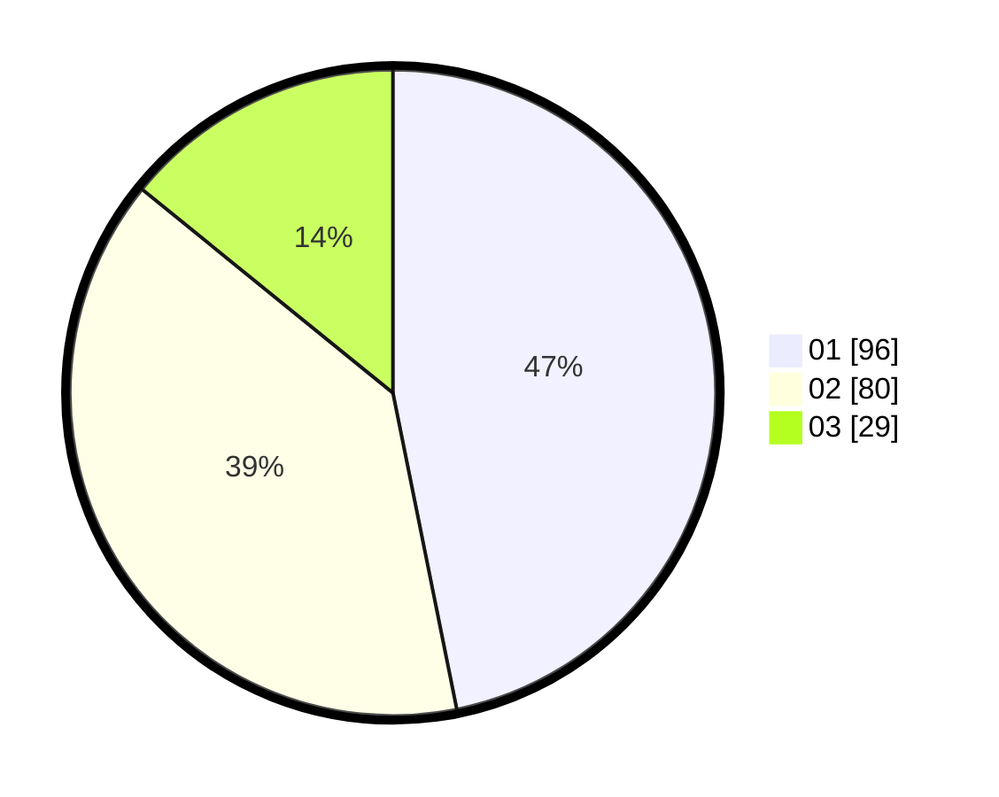

# Hasil

Hasil perolehan suara paslon dapat dilihat pada file paslon-01.txt, paslon-02.txt, dan paslon-03.txt.

Jika tidak ada, artinya data tersebut belum ada pada SIREKAP.

## Perolehan Suara

 * Paslon 01: **96**.
 * Paslon 02: **80**.
 * Paslon 03: **29**.

## Foto C Plano

https://sirekap-obj-formc.kpu.go.id/5451/pemilu/ppwp/31/01/01/10/02/3101011002901-20240214-193836--4e8daee6-d97b-4f7c-b43d-775b8e366d8e.jpg

https://sirekap-obj-formc.kpu.go.id/5451/pemilu/ppwp/31/01/01/10/02/3101011002901-20240214-194212--e29c6889-33d8-4bc8-a71a-9fc6fa4245f8.jpg

https://sirekap-obj-formc.kpu.go.id/5451/pemilu/ppwp/31/01/01/10/02/3101011002901-20240214-194507--e3ceba25-7481-4a32-a23a-237366068426.jpg

## DATA PEMILIH TETAP

Jumlah pemilih dalam DPT: **258**.
 * L: **253**.
 * P: **5**.

## DATA PENGGUNA HAK PILIH

Jumlah pengguna hak pilih dalam DPT: **187**.
 * L: **182**.
 * P: **5**.

Jumlah pengguna hak pilih dalam DPTb: **22**.
 * L: **22**.
 * P: **0**.

Jumlah pengguna hak pilih dalam DPK: **0**.
 * L: **0**.
 * P: **0**.

Jumlah pengguna hak pilih: **209**.
 * L: **204**.
 * P: **5**.

## JUMLAH SUARA SAH DAN TIDAK SAH

JUMLAH SELURUH SUARA SAH: **205**.

JUMLAH SUARA TIDAK SAH: **4**.

JUMLAH SELURUH SUARA SAH DAN SUARA TIDAK SAH: **209**.
