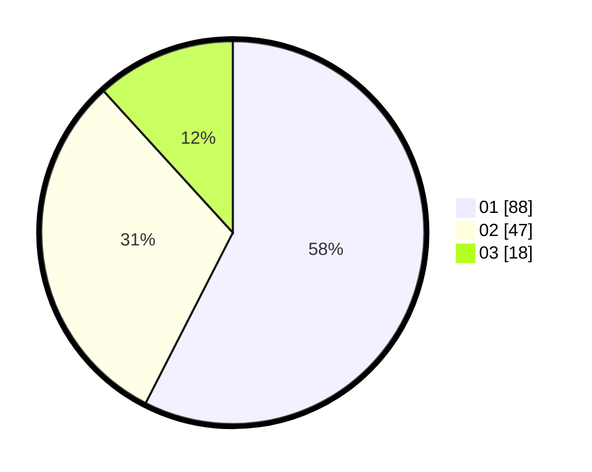

# Hasil

Hasil perolehan suara paslon dapat dilihat pada file paslon-01.txt, paslon-02.txt, dan paslon-03.txt.

Jika tidak ada, artinya data tersebut belum ada pada SIREKAP.

## Perolehan Suara

 * Paslon 01: **88**.
 * Paslon 02: **47**.
 * Paslon 03: **18**.

## Foto C Plano

https://sirekap-obj-formc.kpu.go.id/e54c/pemilu/ppwp/31/01/01/10/02/3101011002907-20240215-022346--64bef951-a5da-4bde-85b7-c0fad887b127.jpg

https://sirekap-obj-formc.kpu.go.id/e54c/pemilu/ppwp/31/01/01/10/02/3101011002907-20240215-022409--28c9075e-ac0a-4b73-bdfa-aefa5653de51.jpg
