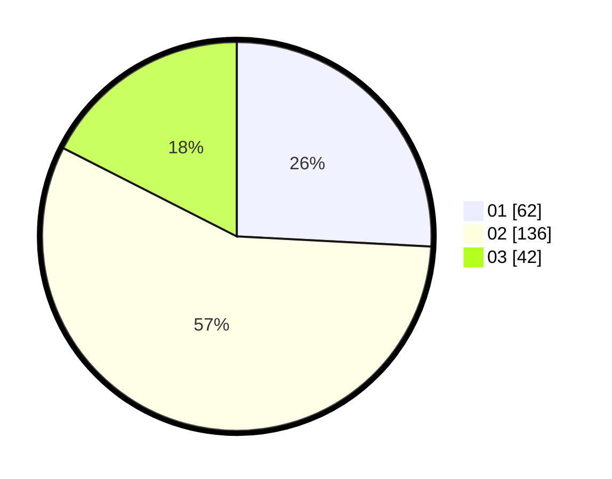

# Hasil

Hasil perolehan suara paslon dapat dilihat pada file paslon-01.txt, paslon-02.txt, dan paslon-03.txt.

Jika tidak ada, artinya data tersebut belum ada pada SIREKAP.

## Perolehan Suara

 * Paslon 01: **62**.
 * Paslon 02: **136**.
 * Paslon 03: **42**.

## Foto C Plano

https://sirekap-obj-formc.kpu.go.id/dac8/pemilu/ppwp/31/01/01/10/03/3101011003003-20240216-150154--8d8570b0-0639-4889-8fa2-8b4582bd8ee8.jpg

https://sirekap-obj-formc.kpu.go.id/dac8/pemilu/ppwp/31/01/01/10/03/3101011003003-20240216-150155--61d71e60-8be9-4fda-aecc-e84d18bcb644.jpg

https://sirekap-obj-formc.kpu.go.id/dac8/pemilu/ppwp/31/01/01/10/03/3101011003003-20240216-150155--7cd81dfe-9575-42cb-a010-97885004db31.jpg

## DATA PEMILIH TETAP

Jumlah pemilih dalam DPT: **270**.
 * L: **136**.
 * P: **134**.

## DATA PENGGUNA HAK PILIH

Jumlah pengguna hak pilih dalam DPT: **243**.
 * L: **120**.
 * P: **123**.

Jumlah pengguna hak pilih dalam DPTb: **3**.
 * L: **3**.
 * P: **0**.

Jumlah pengguna hak pilih dalam DPK: **0**.
 * L: **0**.
 * P: **0**.

Jumlah pengguna hak pilih: **246**.
 * L: **123**.
 * P: **123**.

## JUMLAH SUARA SAH DAN TIDAK SAH

JUMLAH SELURUH SUARA SAH: **240**.

JUMLAH SUARA TIDAK SAH: **6**.

JUMLAH SELURUH SUARA SAH DAN SUARA TIDAK SAH: **246**.
