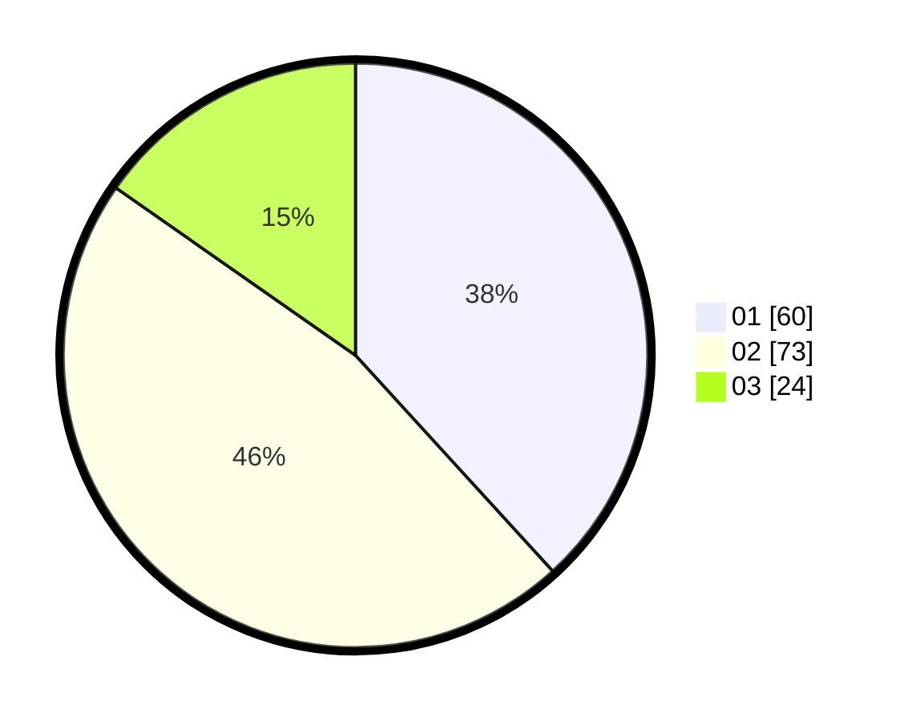

# Hasil

Hasil perolehan suara paslon dapat dilihat pada file paslon-01.txt, paslon-02.txt, dan paslon-03.txt.

Jika tidak ada, artinya data tersebut belum ada pada SIREKAP.

## Perolehan Suara

 * Paslon 01: **60**.
 * Paslon 02: **73**.
 * Paslon 03: **24**.

## Foto C Plano

https://sirekap-obj-formc.kpu.go.id/d433/pemilu/ppwp/31/01/01/10/03/3101011003006-20240216-163220--08ebdba5-291e-49bd-b42b-aa2b3117d152.jpg

https://sirekap-obj-formc.kpu.go.id/d433/pemilu/ppwp/31/01/01/10/03/3101011003006-20240216-163221--814086b3-8080-4edc-ac2f-8ffba132ea7d.jpg

https://sirekap-obj-formc.kpu.go.id/d433/pemilu/ppwp/31/01/01/10/03/3101011003006-20240216-163220--b692db38-b9ca-42b0-add6-373fab79fb3d.jpg

## DATA PEMILIH TETAP

Jumlah pemilih dalam DPT: **203**.
 * L: **93**.
 * P: **110**.

## DATA PENGGUNA HAK PILIH

Jumlah pengguna hak pilih dalam DPT: **155**.
 * L: **72**.
 * P: **83**.

Jumlah pengguna hak pilih dalam DPTb: **3**.
 * L: **1**.
 * P: **2**.

Jumlah pengguna hak pilih dalam DPK: **3**.
 * L: **2**.
 * P: **1**.

Jumlah pengguna hak pilih: **161**.
 * L: **75**.
 * P: **85**.

## JUMLAH SUARA SAH DAN TIDAK SAH

JUMLAH SELURUH SUARA SAH: **157**.

JUMLAH SUARA TIDAK SAH: **4**.

JUMLAH SELURUH SUARA SAH DAN SUARA TIDAK SAH: **161**.
