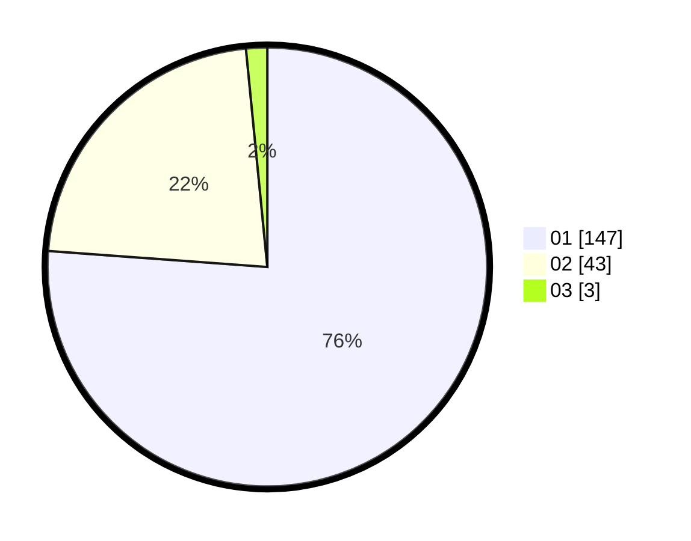

# Hasil

Hasil perolehan suara paslon dapat dilihat pada file paslon-01.txt, paslon-02.txt, dan paslon-03.txt.

Jika tidak ada, artinya data tersebut belum ada pada SIREKAP.

## Perolehan Suara

 * Paslon 01: **147**.
 * Paslon 02: **43**.
 * Paslon 03: **3**.

## Foto C Plano

https://sirekap-obj-formc.kpu.go.id/58bc/pemilu/ppwp/31/01/01/10/03/3101011003007-20240216-112132--66e0be96-75f3-438e-89d3-1056dcfa9372.jpg

https://sirekap-obj-formc.kpu.go.id/58bc/pemilu/ppwp/31/01/01/10/03/3101011003007-20240216-112133--263b1640-d46a-4253-8fae-8d9c35cf5fd8.jpg

https://sirekap-obj-formc.kpu.go.id/58bc/pemilu/ppwp/31/01/01/10/03/3101011003007-20240216-112133--66c54da7-5cdc-49be-84a5-9d60357cf778.jpg

## DATA PEMILIH TETAP

Jumlah pemilih dalam DPT: **224**.
 * L: **112**.
 * P: **112**.

## DATA PENGGUNA HAK PILIH

Jumlah pengguna hak pilih dalam DPT: **189**.
 * L: **97**.
 * P: **92**.

Jumlah pengguna hak pilih dalam DPTb: **4**.
 * L: **4**.
 * P: **0**.

Jumlah pengguna hak pilih dalam DPK: **3**.
 * L: **2**.
 * P: **1**.

Jumlah pengguna hak pilih: **196**.
 * L: **103**.
 * P: **93**.

## JUMLAH SUARA SAH DAN TIDAK SAH

JUMLAH SELURUH SUARA SAH: **193**.

JUMLAH SUARA TIDAK SAH: **3**.

JUMLAH SELURUH SUARA SAH DAN SUARA TIDAK SAH: **196**.
