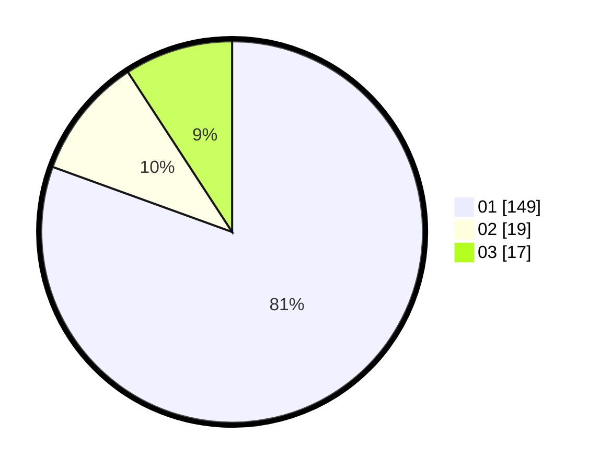

# Hasil

Hasil perolehan suara paslon dapat dilihat pada file paslon-01.txt, paslon-02.txt, dan paslon-03.txt.

Jika tidak ada, artinya data tersebut belum ada pada SIREKAP.

## Perolehan Suara

 * Paslon 01: **149**.
 * Paslon 02: **19**.
 * Paslon 03: **17**.

## Foto C Plano

https://sirekap-obj-formc.kpu.go.id/8abe/pemilu/ppwp/31/01/01/10/03/3101011003008-20240216-003436--c331fb4d-9c1a-4bbe-bb3d-3a9f91df017e.jpg

https://sirekap-obj-formc.kpu.go.id/8abe/pemilu/ppwp/31/01/01/10/03/3101011003008-20240216-003438--6bcdd681-baf9-4b76-8a80-e08559f958c4.jpg

https://sirekap-obj-formc.kpu.go.id/8abe/pemilu/ppwp/31/01/01/10/03/3101011003008-20240216-003436--5e12ba30-3cca-4522-a4b6-2d30f079a976.jpg

## DATA PEMILIH TETAP

Jumlah pemilih dalam DPT: **213**.
 * L: **105**.
 * P: **108**.

## DATA PENGGUNA HAK PILIH

Jumlah pengguna hak pilih dalam DPT: **178**.
 * L: **88**.
 * P: **90**.

Jumlah pengguna hak pilih dalam DPTb: **4**.
 * L: **4**.
 * P: **0**.

Jumlah pengguna hak pilih dalam DPK: **4**.
 * L: **3**.
 * P: **1**.

Jumlah pengguna hak pilih: **186**.
 * L: **95**.
 * P: **91**.

## JUMLAH SUARA SAH DAN TIDAK SAH

JUMLAH SELURUH SUARA SAH: **185**.

JUMLAH SUARA TIDAK SAH: **1**.

JUMLAH SELURUH SUARA SAH DAN SUARA TIDAK SAH: **186**.
