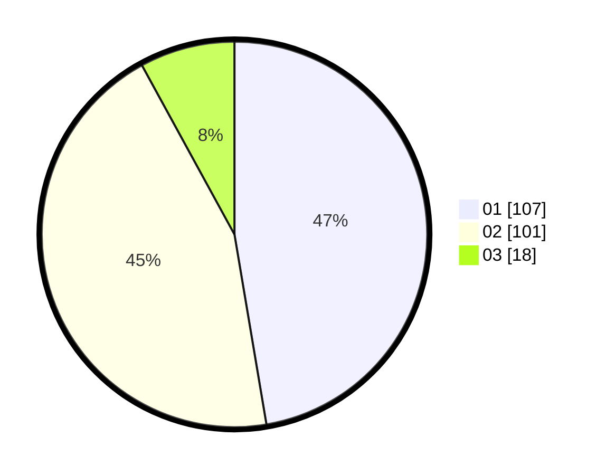

# Hasil

Hasil perolehan suara paslon dapat dilihat pada file paslon-01.txt, paslon-02.txt, dan paslon-03.txt.

Jika tidak ada, artinya data tersebut belum ada pada SIREKAP.

## Perolehan Suara

 * Paslon 01: **107**.
 * Paslon 02: **101**.
 * Paslon 03: **18**.

## Foto C Plano

https://sirekap-obj-formc.kpu.go.id/0316/pemilu/ppwp/31/01/02/10/01/3101021001001-20240214-225631--192e6da8-8d22-471b-8b37-f2771426de47.jpg

https://sirekap-obj-formc.kpu.go.id/0316/pemilu/ppwp/31/01/02/10/01/3101021001001-20240215-120034--a5ce0c67-26af-426b-ad07-5e1cd8ae9f6a.jpg

https://sirekap-obj-formc.kpu.go.id/0316/pemilu/ppwp/31/01/02/10/01/3101021001001-20240215-120650--3d75a436-56c9-448a-93de-34df8b46c1dd.jpg

## DATA PEMILIH TETAP

Jumlah pemilih dalam DPT: **271**.
 * L: **131**.
 * P: **140**.

## DATA PENGGUNA HAK PILIH

Jumlah pengguna hak pilih dalam DPT: **214**.
 * L: **99**.
 * P: **115**.

Jumlah pengguna hak pilih dalam DPTb: **13**.
 * L: **12**.
 * P: **1**.

Jumlah pengguna hak pilih dalam DPK: **3**.
 * L: **3**.
 * P: **0**.

Jumlah pengguna hak pilih: **230**.
 * L: **114**.
 * P: **116**.

## JUMLAH SUARA SAH DAN TIDAK SAH

JUMLAH SELURUH SUARA SAH: **226**.

JUMLAH SUARA TIDAK SAH: **4**.

JUMLAH SELURUH SUARA SAH DAN SUARA TIDAK SAH: **230**.
