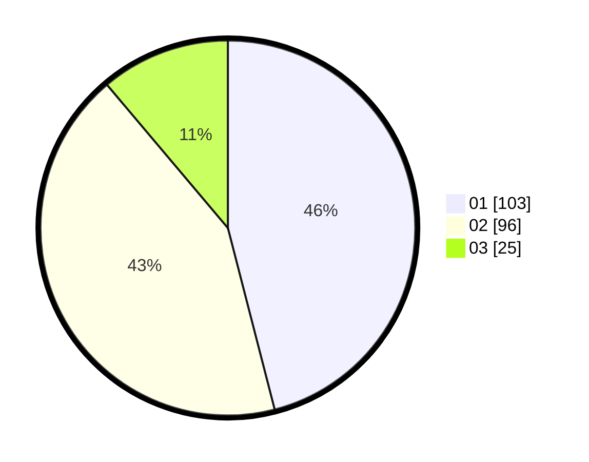

# Hasil

Hasil perolehan suara paslon dapat dilihat pada file paslon-01.txt, paslon-02.txt, dan paslon-03.txt.

Jika tidak ada, artinya data tersebut belum ada pada SIREKAP.

## Perolehan Suara

 * Paslon 01: **103**.
 * Paslon 02: **96**.
 * Paslon 03: **25**.

## Foto C Plano

https://sirekap-obj-formc.kpu.go.id/a23d/pemilu/ppwp/31/01/02/10/01/3101021001003-20240214-185613--71bf34fe-b408-4bf8-b987-c3d19c708b7b.jpg

https://sirekap-obj-formc.kpu.go.id/a23d/pemilu/ppwp/31/01/02/10/01/3101021001003-20240214-190132--e55cebf5-45f6-416b-bac3-c88bb603e97c.jpg

https://sirekap-obj-formc.kpu.go.id/a23d/pemilu/ppwp/31/01/02/10/01/3101021001003-20240214-190259--fba80d1c-7068-434a-a59c-1cfb61780048.jpg

## DATA PEMILIH TETAP

Jumlah pemilih dalam DPT: **269**.
 * L: **137**.
 * P: **132**.

## DATA PENGGUNA HAK PILIH

Jumlah pengguna hak pilih dalam DPT: **228**.
 * L: **115**.
 * P: **113**.

Jumlah pengguna hak pilih dalam DPTb: **1**.
 * L: **1**.
 * P: **0**.

Jumlah pengguna hak pilih dalam DPK: **1**.
 * L: **1**.
 * P: **0**.

Jumlah pengguna hak pilih: **230**.
 * L: **117**.
 * P: **113**.

## JUMLAH SUARA SAH DAN TIDAK SAH

JUMLAH SELURUH SUARA SAH: **224**.

JUMLAH SUARA TIDAK SAH: **6**.

JUMLAH SELURUH SUARA SAH DAN SUARA TIDAK SAH: **230**.
