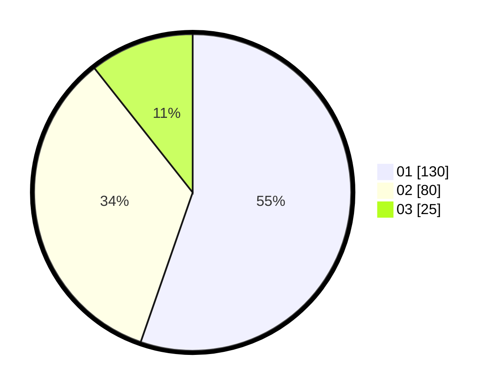

# Hasil

Hasil perolehan suara paslon dapat dilihat pada file paslon-01.txt, paslon-02.txt, dan paslon-03.txt.

Jika tidak ada, artinya data tersebut belum ada pada SIREKAP.

## Perolehan Suara

 * Paslon 01: **130**.
 * Paslon 02: **80**.
 * Paslon 03: **25**.

## Foto C Plano

https://sirekap-obj-formc.kpu.go.id/ea16/pemilu/ppwp/31/01/02/10/01/3101021001004-20240216-135150--96e4042b-3c32-46d9-93ed-ce7b819eb2f5.jpg

https://sirekap-obj-formc.kpu.go.id/ea16/pemilu/ppwp/31/01/02/10/01/3101021001004-20240216-135151--110c6eff-d773-4fc6-b020-2e2ee3760728.jpg

https://sirekap-obj-formc.kpu.go.id/ea16/pemilu/ppwp/31/01/02/10/01/3101021001004-20240216-135150--e453c429-a3ec-4d7d-8de3-631b494e87e0.jpg

## DATA PEMILIH TETAP

Jumlah pemilih dalam DPT: **270**.
 * L: **137**.
 * P: **133**.

## DATA PENGGUNA HAK PILIH

Jumlah pengguna hak pilih dalam DPT: **221**.
 * L: **108**.
 * P: **113**.

Jumlah pengguna hak pilih dalam DPTb: **14**.
 * L: **8**.
 * P: **6**.

Jumlah pengguna hak pilih dalam DPK: **3**.
 * L: **0**.
 * P: **3**.

Jumlah pengguna hak pilih: **238**.
 * L: **116**.
 * P: **122**.

## JUMLAH SUARA SAH DAN TIDAK SAH

JUMLAH SELURUH SUARA SAH: **235**.

JUMLAH SUARA TIDAK SAH: **3**.

JUMLAH SELURUH SUARA SAH DAN SUARA TIDAK SAH: **238**.
