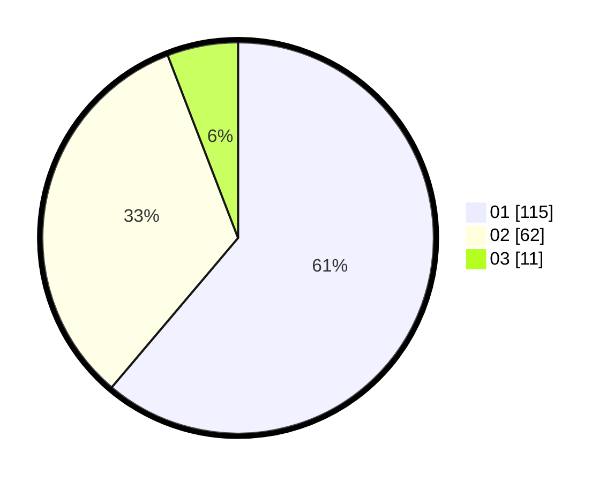

# Hasil

Hasil perolehan suara paslon dapat dilihat pada file paslon-01.txt, paslon-02.txt, dan paslon-03.txt.

Jika tidak ada, artinya data tersebut belum ada pada SIREKAP.

## Perolehan Suara

 * Paslon 01: **115**.
 * Paslon 02: **62**.
 * Paslon 03: **11**.

## Foto C Plano

https://sirekap-obj-formc.kpu.go.id/c6fc/pemilu/ppwp/31/01/02/10/01/3101021001006-20240216-060310--ff0d3481-9191-469a-99fb-583a07a740d8.jpg

https://sirekap-obj-formc.kpu.go.id/c6fc/pemilu/ppwp/31/01/02/10/01/3101021001006-20240216-060326--34cf7c6b-a706-45c2-8088-d91189ef0412.jpg

https://sirekap-obj-formc.kpu.go.id/c6fc/pemilu/ppwp/31/01/02/10/01/3101021001006-20240216-054246--8c570362-7179-42b9-8e3a-d84fff0c826e.jpg

## DATA PEMILIH TETAP

Jumlah pemilih dalam DPT: **177**.
 * L: **91**.
 * P: **86**.

## DATA PENGGUNA HAK PILIH

Jumlah pengguna hak pilih dalam DPT: **177**.
 * L: **91**.
 * P: **86**.

Jumlah pengguna hak pilih dalam DPTb: **13**.
 * L: **6**.
 * P: **7**.

Jumlah pengguna hak pilih dalam DPK: **1**.
 * L: **0**.
 * P: **1**.

Jumlah pengguna hak pilih: **191**.
 * L: **97**.
 * P: **94**.

## JUMLAH SUARA SAH DAN TIDAK SAH

JUMLAH SELURUH SUARA SAH: **188**.

JUMLAH SUARA TIDAK SAH: **3**.

JUMLAH SELURUH SUARA SAH DAN SUARA TIDAK SAH: **191**.
