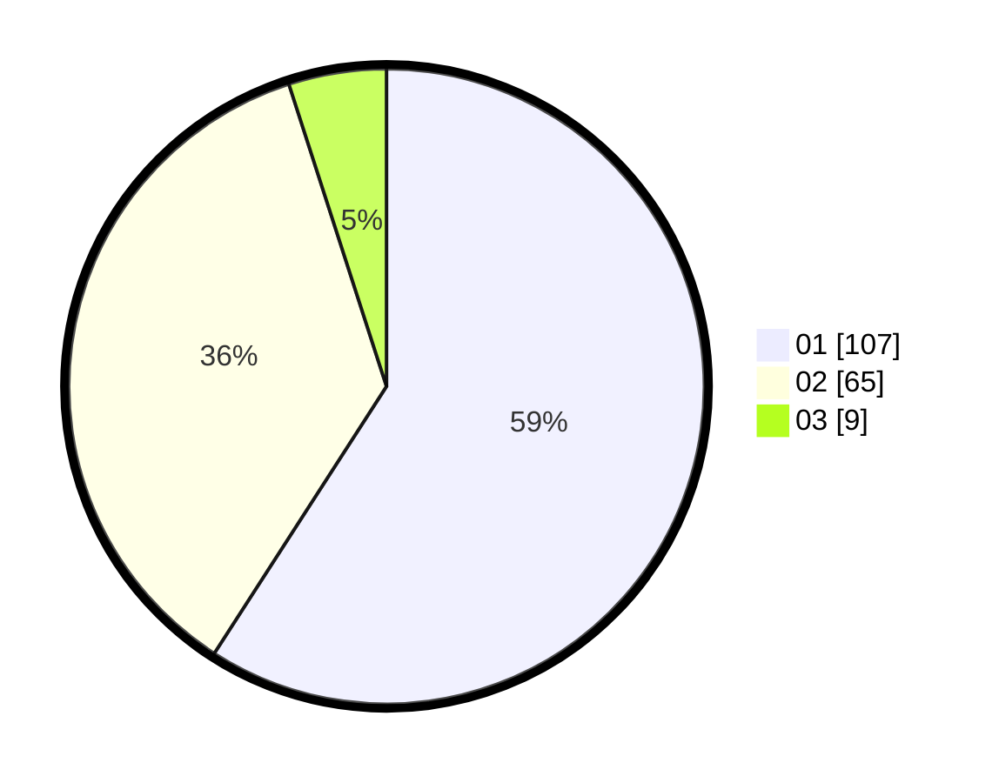

# Hasil

Hasil perolehan suara paslon dapat dilihat pada file paslon-01.txt, paslon-02.txt, dan paslon-03.txt.

Jika tidak ada, artinya data tersebut belum ada pada SIREKAP.

## Perolehan Suara

 * Paslon 01: **107**.
 * Paslon 02: **65**.
 * Paslon 03: **9**.

## Foto C Plano

https://sirekap-obj-formc.kpu.go.id/4850/pemilu/ppwp/31/01/02/10/01/3101021001007-20240216-082744--be39b200-72a9-4c7f-a808-707e03a5e7f8.jpg

https://sirekap-obj-formc.kpu.go.id/4850/pemilu/ppwp/31/01/02/10/01/3101021001007-20240216-124008--6bb9c3eb-48ca-43fe-9449-d440f017bac1.jpg

https://sirekap-obj-formc.kpu.go.id/4850/pemilu/ppwp/31/01/02/10/01/3101021001007-20240216-082749--77936907-9695-4a29-88b7-d2f2c04f93ac.jpg

## DATA PEMILIH TETAP

Jumlah pemilih dalam DPT: **219**.
 * L: **111**.
 * P: **108**.

## DATA PENGGUNA HAK PILIH

Jumlah pengguna hak pilih dalam DPT: **174**.
 * L: **88**.
 * P: **86**.

Jumlah pengguna hak pilih dalam DPTb: **10**.
 * L: **6**.
 * P: **4**.

Jumlah pengguna hak pilih dalam DPK: **2**.
 * L: **0**.
 * P: **2**.

Jumlah pengguna hak pilih: **186**.
 * L: **94**.
 * P: **92**.

## JUMLAH SUARA SAH DAN TIDAK SAH

JUMLAH SELURUH SUARA SAH: **181**.

JUMLAH SUARA TIDAK SAH: **5**.

JUMLAH SELURUH SUARA SAH DAN SUARA TIDAK SAH: **186**.
