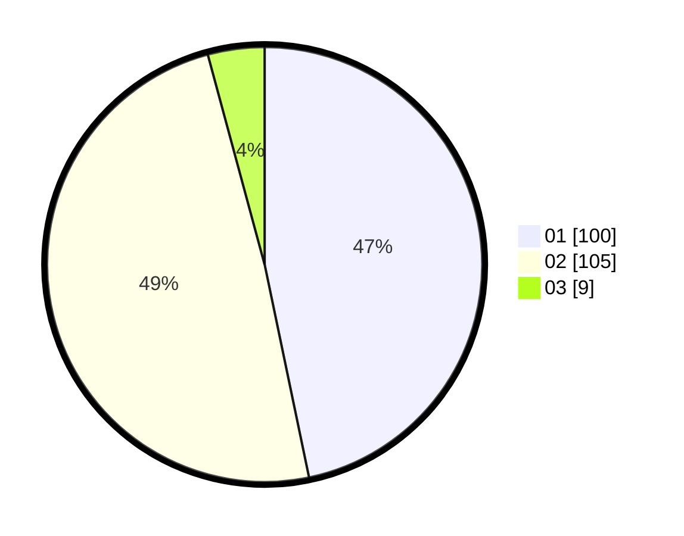

# Hasil

Hasil perolehan suara paslon dapat dilihat pada file paslon-01.txt, paslon-02.txt, dan paslon-03.txt.

Jika tidak ada, artinya data tersebut belum ada pada SIREKAP.

## Perolehan Suara

 * Paslon 01: **100**.
 * Paslon 02: **105**.
 * Paslon 03: **9**.

## Foto C Plano

https://sirekap-obj-formc.kpu.go.id/944a/pemilu/ppwp/31/01/02/10/02/3101021002003-20240215-222208--d102d9a5-81f4-4882-ba1c-6285ad64c893.jpg

https://sirekap-obj-formc.kpu.go.id/944a/pemilu/ppwp/31/01/02/10/02/3101021002003-20240215-222209--0a971b9b-08a2-4f26-a766-b4ac37e1dea3.jpg

https://sirekap-obj-formc.kpu.go.id/944a/pemilu/ppwp/31/01/02/10/02/3101021002003-20240215-222209--7499843f-6abb-4136-b388-9f82fd76a238.jpg

## DATA PEMILIH TETAP

Jumlah pemilih dalam DPT: **261**.
 * L: **126**.
 * P: **135**.

## DATA PENGGUNA HAK PILIH

Jumlah pengguna hak pilih dalam DPT: **220**.
 * L: **102**.
 * P: **118**.

Jumlah pengguna hak pilih dalam DPTb: **0**.
 * L: **0**.
 * P: **0**.

Jumlah pengguna hak pilih dalam DPK: **0**.
 * L: **0**.
 * P: **0**.

Jumlah pengguna hak pilih: **220**.
 * L: **102**.
 * P: **118**.

## JUMLAH SUARA SAH DAN TIDAK SAH

JUMLAH SELURUH SUARA SAH: **214**.

JUMLAH SUARA TIDAK SAH: **6**.

JUMLAH SELURUH SUARA SAH DAN SUARA TIDAK SAH: **220**.
