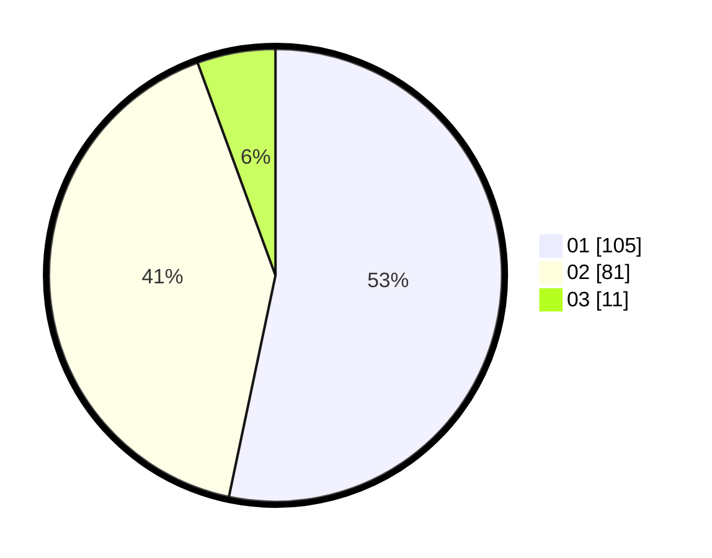

# Hasil

Hasil perolehan suara paslon dapat dilihat pada file paslon-01.txt, paslon-02.txt, dan paslon-03.txt.

Jika tidak ada, artinya data tersebut belum ada pada SIREKAP.

## Perolehan Suara

 * Paslon 01: **105**.
 * Paslon 02: **81**.
 * Paslon 03: **11**.

## Foto C Plano

https://sirekap-obj-formc.kpu.go.id/8e94/pemilu/ppwp/31/01/02/10/02/3101021002004-20240216-122440--2131e8e4-25a1-4a8d-87f2-7efb45f5c065.jpg

https://sirekap-obj-formc.kpu.go.id/8e94/pemilu/ppwp/31/01/02/10/02/3101021002004-20240216-122441--998f89e5-a3cf-43ad-b5cc-0c0c4434a161.jpg

https://sirekap-obj-formc.kpu.go.id/8e94/pemilu/ppwp/31/01/02/10/02/3101021002004-20240216-122440--ac16fe3f-dbd4-454a-86f1-903bcfe542c6.jpg

## DATA PEMILIH TETAP

Jumlah pemilih dalam DPT: **265**.
 * L: **130**.
 * P: **135**.

## DATA PENGGUNA HAK PILIH

Jumlah pengguna hak pilih dalam DPT: **208**.
 * L: **99**.
 * P: **109**.

Jumlah pengguna hak pilih dalam DPTb: **3**.
 * L: **2**.
 * P: **1**.

Jumlah pengguna hak pilih dalam DPK: **0**.
 * L: **0**.
 * P: **0**.

Jumlah pengguna hak pilih: **211**.
 * L: **101**.
 * P: **110**.

## JUMLAH SUARA SAH DAN TIDAK SAH

JUMLAH SELURUH SUARA SAH: **207**.

JUMLAH SUARA TIDAK SAH: **4**.

JUMLAH SELURUH SUARA SAH DAN SUARA TIDAK SAH: **211**.
