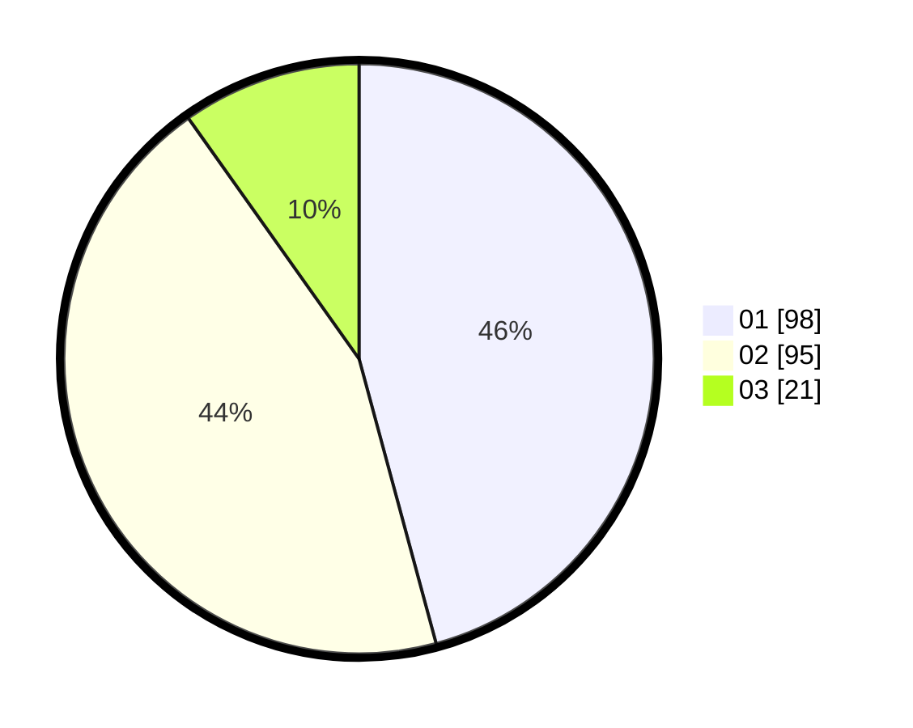

# Hasil

Hasil perolehan suara paslon dapat dilihat pada file paslon-01.txt, paslon-02.txt, dan paslon-03.txt.

Jika tidak ada, artinya data tersebut belum ada pada SIREKAP.

## Perolehan Suara

 * Paslon 01: **98**.
 * Paslon 02: **95**.
 * Paslon 03: **21**.

## Foto C Plano

https://sirekap-obj-formc.kpu.go.id/8457/pemilu/ppwp/31/01/02/10/02/3101021002006-20240215-214357--ded3f795-b6f2-427c-978e-a84ed676a129.jpg

https://sirekap-obj-formc.kpu.go.id/8457/pemilu/ppwp/31/01/02/10/02/3101021002006-20240215-214359--4dc35ce1-bf09-41a2-9c5d-d30dbe550329.jpg

https://sirekap-obj-formc.kpu.go.id/8457/pemilu/ppwp/31/01/02/10/02/3101021002006-20240215-214359--72b5d8e6-d6d2-4045-bee8-0e2e14040955.jpg

## DATA PEMILIH TETAP

Jumlah pemilih dalam DPT: **267**.
 * L: **132**.
 * P: **135**.

## DATA PENGGUNA HAK PILIH

Jumlah pengguna hak pilih dalam DPT: **205**.
 * L: **97**.
 * P: **108**.

Jumlah pengguna hak pilih dalam DPTb: **11**.
 * L: **7**.
 * P: **4**.

Jumlah pengguna hak pilih dalam DPK: **0**.
 * L: **0**.
 * P: **0**.

Jumlah pengguna hak pilih: **216**.
 * L: **104**.
 * P: **112**.

## JUMLAH SUARA SAH DAN TIDAK SAH

JUMLAH SELURUH SUARA SAH: **214**.

JUMLAH SUARA TIDAK SAH: **2**.

JUMLAH SELURUH SUARA SAH DAN SUARA TIDAK SAH: **216**.
