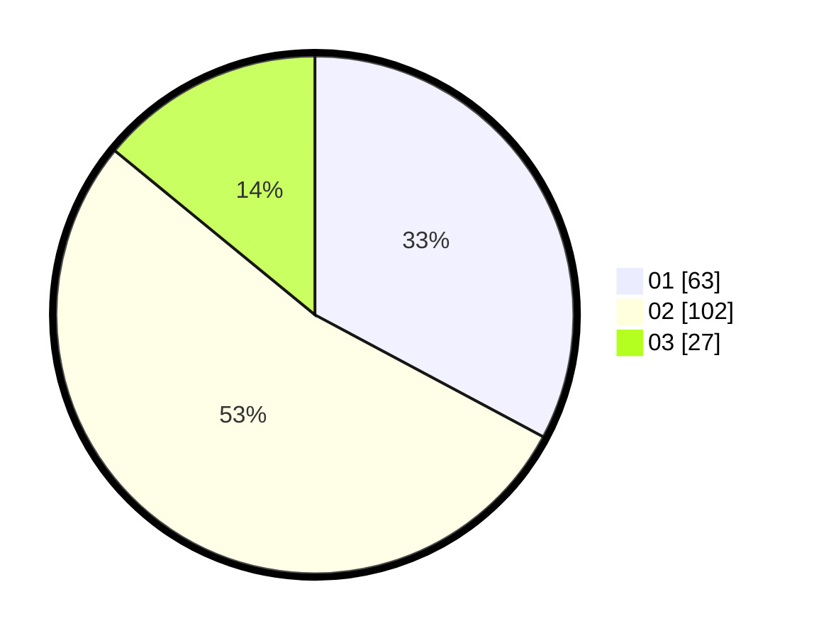

# Hasil

Hasil perolehan suara paslon dapat dilihat pada file paslon-01.txt, paslon-02.txt, dan paslon-03.txt.

Jika tidak ada, artinya data tersebut belum ada pada SIREKAP.

## Perolehan Suara

 * Paslon 01: **63**.
 * Paslon 02: **102**.
 * Paslon 03: **27**.

## Foto C Plano

https://sirekap-obj-formc.kpu.go.id/8ab8/pemilu/ppwp/31/01/02/10/02/3101021002008-20240215-214117--6f711a53-0715-4ba4-8e1c-0116c54114c4.jpg

https://sirekap-obj-formc.kpu.go.id/8ab8/pemilu/ppwp/31/01/02/10/02/3101021002008-20240215-214119--e3dccea8-3877-4070-8d62-91cd9777e034.jpg

https://sirekap-obj-formc.kpu.go.id/8ab8/pemilu/ppwp/31/01/02/10/02/3101021002008-20240215-214118--a56e4de5-7aaa-4b3b-8c33-e25ccb5710af.jpg

## DATA PEMILIH TETAP

Jumlah pemilih dalam DPT: **223**.
 * L: **106**.
 * P: **117**.

## DATA PENGGUNA HAK PILIH

Jumlah pengguna hak pilih dalam DPT: **180**.
 * L: **84**.
 * P: **96**.

Jumlah pengguna hak pilih dalam DPTb: **12**.
 * L: **3**.
 * P: **9**.

Jumlah pengguna hak pilih dalam DPK: **4**.
 * L: **3**.
 * P: **1**.

Jumlah pengguna hak pilih: **196**.
 * L: **90**.
 * P: **106**.

## JUMLAH SUARA SAH DAN TIDAK SAH

JUMLAH SELURUH SUARA SAH: **192**.

JUMLAH SUARA TIDAK SAH: **4**.

JUMLAH SELURUH SUARA SAH DAN SUARA TIDAK SAH: **196**.
