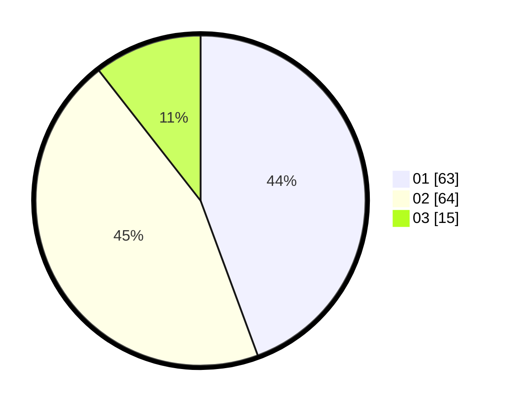

# Hasil

Hasil perolehan suara paslon dapat dilihat pada file paslon-01.txt, paslon-02.txt, dan paslon-03.txt.

Jika tidak ada, artinya data tersebut belum ada pada SIREKAP.

## Perolehan Suara

 * Paslon 01: **63**.
 * Paslon 02: **64**.
 * Paslon 03: **15**.

## Foto C Plano

https://sirekap-obj-formc.kpu.go.id/d9cd/pemilu/ppwp/31/01/02/10/02/3101021002010-20240216-033957--8d8083b8-e50c-4def-8ce9-a603e5a10ef3.jpg

https://sirekap-obj-formc.kpu.go.id/d9cd/pemilu/ppwp/31/01/02/10/02/3101021002010-20240214-223052--da5146b0-5ea5-4c76-b4fb-3d11e5040b44.jpg

https://sirekap-obj-formc.kpu.go.id/d9cd/pemilu/ppwp/31/01/02/10/02/3101021002010-20240216-040119--b63bc1e2-28ee-42eb-a14f-5bfdee67330b.jpg

## DATA PEMILIH TETAP

Jumlah pemilih dalam DPT: **145**.
 * L: **70**.
 * P: **75**.

## DATA PENGGUNA HAK PILIH

Jumlah pengguna hak pilih dalam DPT: **145**.
 * L: **70**.
 * P: **75**.

Jumlah pengguna hak pilih dalam DPTb: **0**.
 * L: **0**.
 * P: **0**.

Jumlah pengguna hak pilih dalam DPK: **1**.
 * L: **0**.
 * P: **1**.

Jumlah pengguna hak pilih: **146**.
 * L: **70**.
 * P: **76**.

## JUMLAH SUARA SAH DAN TIDAK SAH

JUMLAH SELURUH SUARA SAH: **142**.

JUMLAH SUARA TIDAK SAH: **4**.

JUMLAH SELURUH SUARA SAH DAN SUARA TIDAK SAH: **146**.
