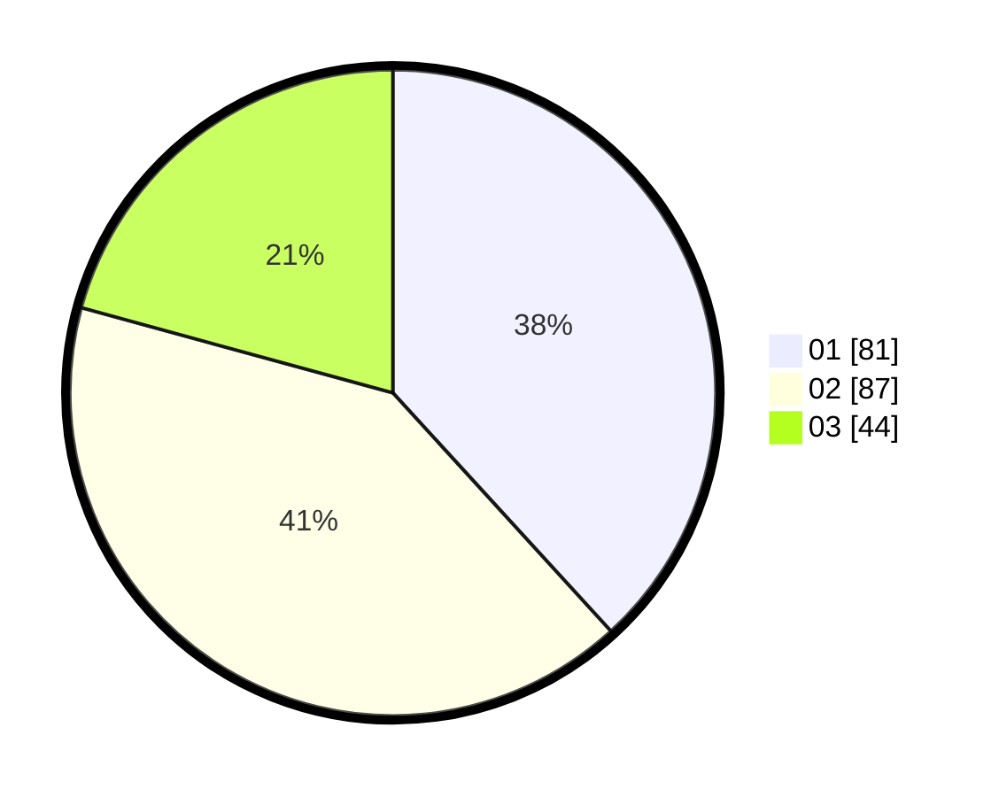

# Hasil

Hasil perolehan suara paslon dapat dilihat pada file paslon-01.txt, paslon-02.txt, dan paslon-03.txt.

Jika tidak ada, artinya data tersebut belum ada pada SIREKAP.

## Perolehan Suara

 * Paslon 01: **81**.
 * Paslon 02: **87**.
 * Paslon 03: **44**.

## Foto C Plano

https://sirekap-obj-formc.kpu.go.id/e1b5/pemilu/ppwp/31/01/02/10/02/3101021002014-20240215-235438--c452cb60-7abe-4990-bedf-e5a9d890f763.jpg

https://sirekap-obj-formc.kpu.go.id/e1b5/pemilu/ppwp/31/01/02/10/02/3101021002014-20240215-235439--3788fdbe-ed32-411e-b213-1baad01e97a5.jpg

https://sirekap-obj-formc.kpu.go.id/e1b5/pemilu/ppwp/31/01/02/10/02/3101021002014-20240215-235438--7fa84f8d-d6a5-4db6-b91c-eafa8621a2f7.jpg

## DATA PEMILIH TETAP

Jumlah pemilih dalam DPT: **270**.
 * L: **137**.
 * P: **133**.

## DATA PENGGUNA HAK PILIH

Jumlah pengguna hak pilih dalam DPT: **219**.
 * L: **111**.
 * P: **108**.

Jumlah pengguna hak pilih dalam DPTb: **0**.
 * L: **0**.
 * P: **0**.

Jumlah pengguna hak pilih dalam DPK: **0**.
 * L: **0**.
 * P: **0**.

Jumlah pengguna hak pilih: **219**.
 * L: **111**.
 * P: **108**.

## JUMLAH SUARA SAH DAN TIDAK SAH

JUMLAH SELURUH SUARA SAH: **212**.

JUMLAH SUARA TIDAK SAH: **7**.

JUMLAH SELURUH SUARA SAH DAN SUARA TIDAK SAH: **219**.
