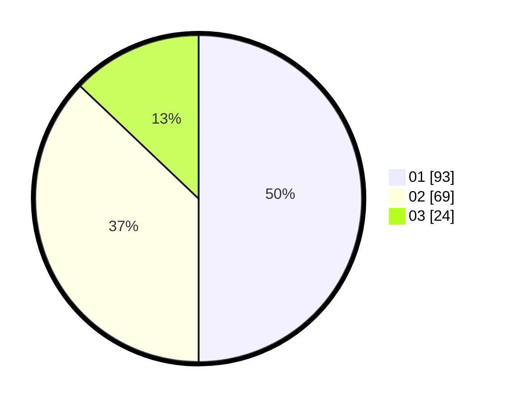

# Hasil

Hasil perolehan suara paslon dapat dilihat pada file paslon-01.txt, paslon-02.txt, dan paslon-03.txt.

Jika tidak ada, artinya data tersebut belum ada pada SIREKAP.

## Perolehan Suara

 * Paslon 01: **93**.
 * Paslon 02: **69**.
 * Paslon 03: **24**.

## Foto C Plano

https://sirekap-obj-formc.kpu.go.id/93d5/pemilu/ppwp/31/01/02/10/02/3101021002015-20240214-194231--78f56217-df52-45d6-bbd3-2a81c7461c05.jpg

https://sirekap-obj-formc.kpu.go.id/93d5/pemilu/ppwp/31/01/02/10/02/3101021002015-20240214-141341--09d60491-fc23-4002-8486-7e20415eea67.jpg

https://sirekap-obj-formc.kpu.go.id/93d5/pemilu/ppwp/31/01/02/10/02/3101021002015-20240214-141716--6d5cca41-ce10-44f1-a36e-1740ee0c07ec.jpg

## DATA PEMILIH TETAP

Jumlah pemilih dalam DPT: **214**.
 * L: **110**.
 * P: **104**.

## DATA PENGGUNA HAK PILIH

Jumlah pengguna hak pilih dalam DPT: **187**.
 * L: **93**.
 * P: **94**.

Jumlah pengguna hak pilih dalam DPTb: **1**.
 * L: **1**.
 * P: **0**.

Jumlah pengguna hak pilih dalam DPK: **0**.
 * L: **0**.
 * P: **0**.

Jumlah pengguna hak pilih: **188**.
 * L: **94**.
 * P: **94**.

## JUMLAH SUARA SAH DAN TIDAK SAH

JUMLAH SELURUH SUARA SAH: **186**.

JUMLAH SUARA TIDAK SAH: **2**.

JUMLAH SELURUH SUARA SAH DAN SUARA TIDAK SAH: **188**.
