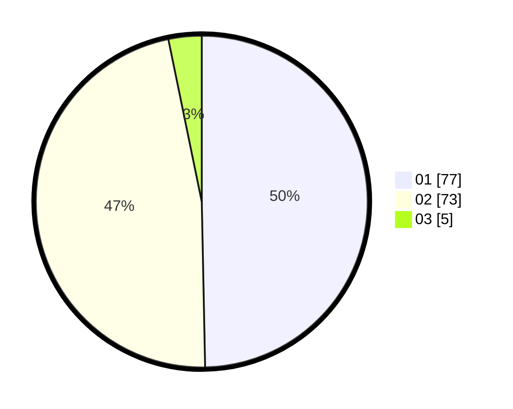

# Hasil

Hasil perolehan suara paslon dapat dilihat pada file paslon-01.txt, paslon-02.txt, dan paslon-03.txt.

Jika tidak ada, artinya data tersebut belum ada pada SIREKAP.

## Perolehan Suara

 * Paslon 01: **77**.
 * Paslon 02: **73**.
 * Paslon 03: **5**.

## Foto C Plano

https://sirekap-obj-formc.kpu.go.id/591f/pemilu/ppwp/31/01/02/10/02/3101021002016-20240214-203427--4f3825d5-4245-4e90-a89a-3dbadf9174b7.jpg

https://sirekap-obj-formc.kpu.go.id/591f/pemilu/ppwp/31/01/02/10/02/3101021002016-20240214-204402--abf2f5b7-e66c-4e3b-9e23-ef1a5c1c25c3.jpg

https://sirekap-obj-formc.kpu.go.id/591f/pemilu/ppwp/31/01/02/10/02/3101021002016-20240214-204517--7b2ba025-a06e-4b3e-a5d6-dce8c633fb6a.jpg

## DATA PEMILIH TETAP

Jumlah pemilih dalam DPT: **202**.
 * L: **101**.
 * P: **101**.

## DATA PENGGUNA HAK PILIH

Jumlah pengguna hak pilih dalam DPT: **157**.
 * L: **74**.
 * P: **83**.

Jumlah pengguna hak pilih dalam DPTb: **0**.
 * L: **0**.
 * P: **0**.

Jumlah pengguna hak pilih dalam DPK: **0**.
 * L: **0**.
 * P: **0**.

Jumlah pengguna hak pilih: **157**.
 * L: **74**.
 * P: **83**.

## JUMLAH SUARA SAH DAN TIDAK SAH

JUMLAH SELURUH SUARA SAH: **155**.

JUMLAH SUARA TIDAK SAH: **2**.

JUMLAH SELURUH SUARA SAH DAN SUARA TIDAK SAH: **157**.
