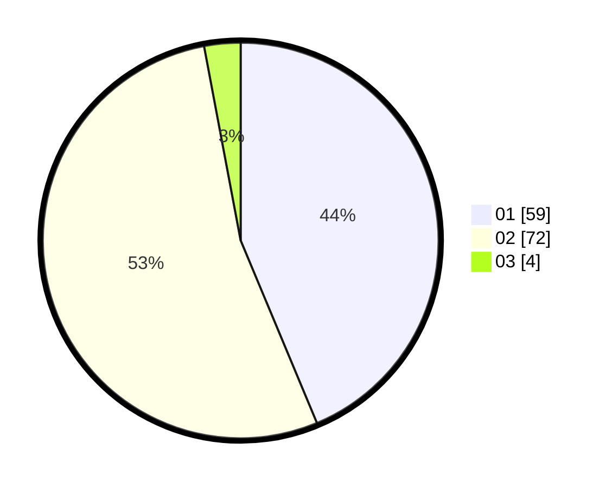

# Hasil

Hasil perolehan suara paslon dapat dilihat pada file paslon-01.txt, paslon-02.txt, dan paslon-03.txt.

Jika tidak ada, artinya data tersebut belum ada pada SIREKAP.

## Perolehan Suara

 * Paslon 01: **59**.
 * Paslon 02: **72**.
 * Paslon 03: **4**.

## Foto C Plano

https://sirekap-obj-formc.kpu.go.id/1adb/pemilu/ppwp/31/01/02/10/02/3101021002018-20240214-194742--adeb5435-f068-4bb0-9381-02e539959497.jpg

https://sirekap-obj-formc.kpu.go.id/1adb/pemilu/ppwp/31/01/02/10/02/3101021002018-20240214-193259--6b74a7bd-08e1-4e19-aa1c-71f2d9b9b857.jpg

https://sirekap-obj-formc.kpu.go.id/1adb/pemilu/ppwp/31/01/02/10/02/3101021002018-20240214-195435--9434e922-c9d4-4793-876f-9a22db2b8c2a.jpg

## DATA PEMILIH TETAP

Jumlah pemilih dalam DPT: **150**.
 * L: **75**.
 * P: **75**.

## DATA PENGGUNA HAK PILIH

Jumlah pengguna hak pilih dalam DPT: **131**.
 * L: **67**.
 * P: **64**.

Jumlah pengguna hak pilih dalam DPTb: **3**.
 * L: **3**.
 * P: **0**.

Jumlah pengguna hak pilih dalam DPK: **4**.
 * L: **1**.
 * P: **3**.

Jumlah pengguna hak pilih: **138**.
 * L: **71**.
 * P: **67**.

## JUMLAH SUARA SAH DAN TIDAK SAH

JUMLAH SELURUH SUARA SAH: **135**.

JUMLAH SUARA TIDAK SAH: **3**.

JUMLAH SELURUH SUARA SAH DAN SUARA TIDAK SAH: **138**.
