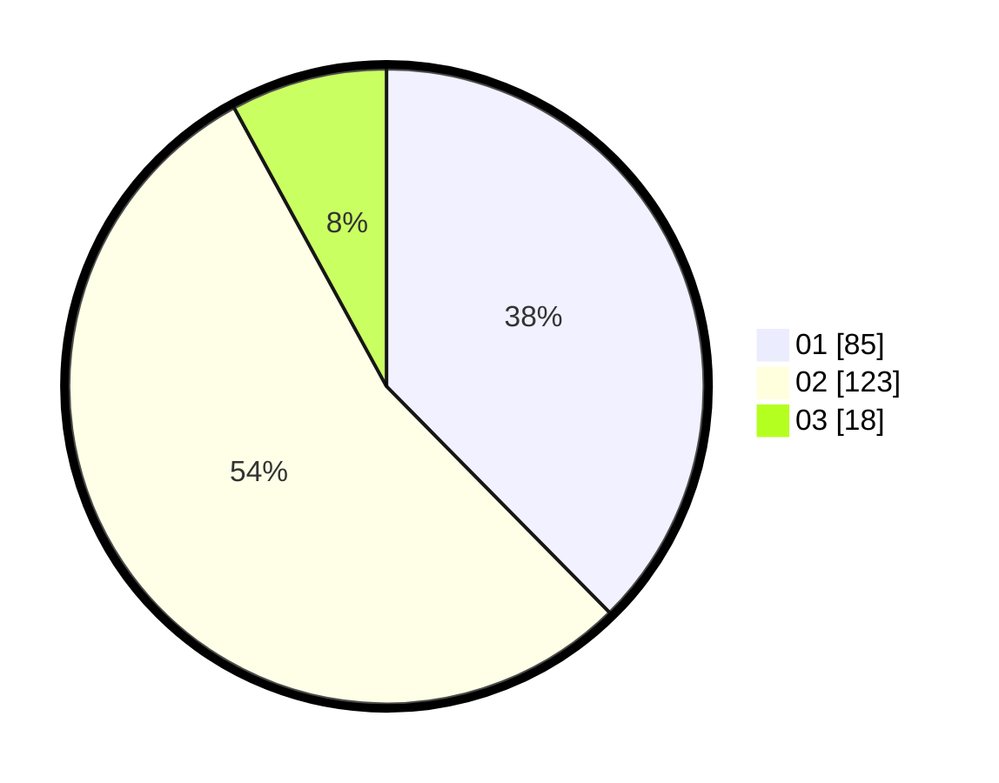

# Hasil

Hasil perolehan suara paslon dapat dilihat pada file paslon-01.txt, paslon-02.txt, dan paslon-03.txt.

Jika tidak ada, artinya data tersebut belum ada pada SIREKAP.

## Perolehan Suara

 * Paslon 01: **85**.
 * Paslon 02: **123**.
 * Paslon 03: **18**.

## Foto C Plano

https://sirekap-obj-formc.kpu.go.id/ae6f/pemilu/ppwp/31/01/02/10/03/3101021003001-20240216-152635--80d81b52-6d1a-46ef-893a-7f42a15601eb.jpg

https://sirekap-obj-formc.kpu.go.id/ae6f/pemilu/ppwp/31/01/02/10/03/3101021003001-20240216-152636--2bb96e17-e82d-4c73-a4e2-e888683eb58d.jpg

https://sirekap-obj-formc.kpu.go.id/ae6f/pemilu/ppwp/31/01/02/10/03/3101021003001-20240216-152635--8e250024-cc2b-46d0-88cd-255484f55919.jpg

## DATA PEMILIH TETAP

Jumlah pemilih dalam DPT: **0**.
 * L: **0**.
 * P: **0**.

## DATA PENGGUNA HAK PILIH

Jumlah pengguna hak pilih dalam DPT: **0**.
 * L: **0**.
 * P: **0**.

Jumlah pengguna hak pilih dalam DPTb: **0**.
 * L: **0**.
 * P: **0**.

Jumlah pengguna hak pilih dalam DPK: **0**.
 * L: **0**.
 * P: **0**.

Jumlah pengguna hak pilih: **0**.
 * L: **0**.
 * P: **0**.

## JUMLAH SUARA SAH DAN TIDAK SAH

JUMLAH SELURUH SUARA SAH: **222**.

JUMLAH SUARA TIDAK SAH: **3**.

JUMLAH SELURUH SUARA SAH DAN SUARA TIDAK SAH: **225**.
