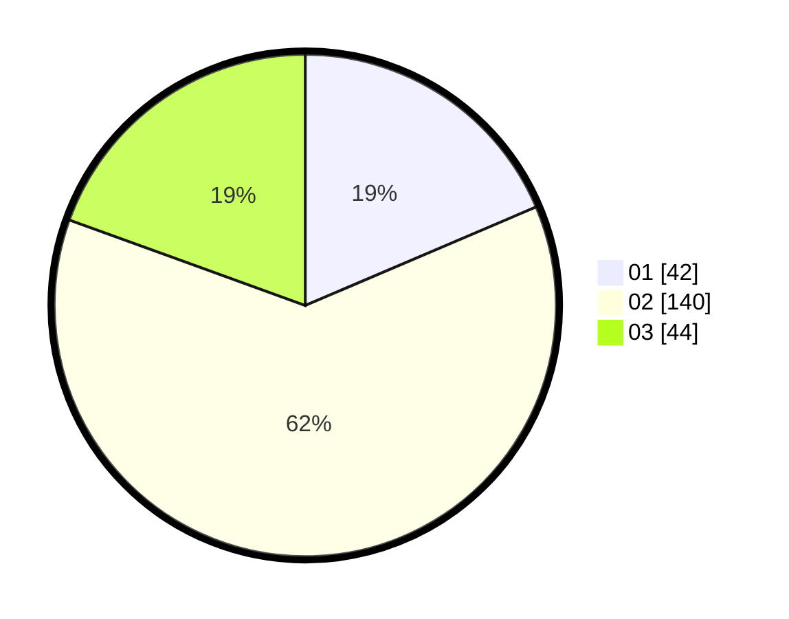

# Hasil

Hasil perolehan suara paslon dapat dilihat pada file paslon-01.txt, paslon-02.txt, dan paslon-03.txt.

Jika tidak ada, artinya data tersebut belum ada pada SIREKAP.

## Perolehan Suara

 * Paslon 01: **42**.
 * Paslon 02: **140**.
 * Paslon 03: **44**.

## Foto C Plano

https://sirekap-obj-formc.kpu.go.id/0337/pemilu/ppwp/31/01/02/10/03/3101021003005-20240215-015413--463e814d-b9af-4572-a303-44a5fdeb35ff.jpg

https://sirekap-obj-formc.kpu.go.id/0337/pemilu/ppwp/31/01/02/10/03/3101021003005-20240215-015518--ef9a04f2-3584-4a95-a719-b134870dd5d0.jpg

https://sirekap-obj-formc.kpu.go.id/0337/pemilu/ppwp/31/01/02/10/03/3101021003005-20240215-015615--a5b5e5d1-0465-43b9-b9c8-7014a5854582.jpg

## DATA PEMILIH TETAP

Jumlah pemilih dalam DPT: **258**.
 * L: **131**.
 * P: **127**.

## DATA PENGGUNA HAK PILIH

Jumlah pengguna hak pilih dalam DPT: **228**.
 * L: **116**.
 * P: **112**.

Jumlah pengguna hak pilih dalam DPTb: **3**.
 * L: **1**.
 * P: **2**.

Jumlah pengguna hak pilih dalam DPK: **1**.
 * L: **1**.
 * P: **0**.

Jumlah pengguna hak pilih: **232**.
 * L: **118**.
 * P: **114**.

## JUMLAH SUARA SAH DAN TIDAK SAH

JUMLAH SELURUH SUARA SAH: **226**.

JUMLAH SUARA TIDAK SAH: **6**.

JUMLAH SELURUH SUARA SAH DAN SUARA TIDAK SAH: **232**.
