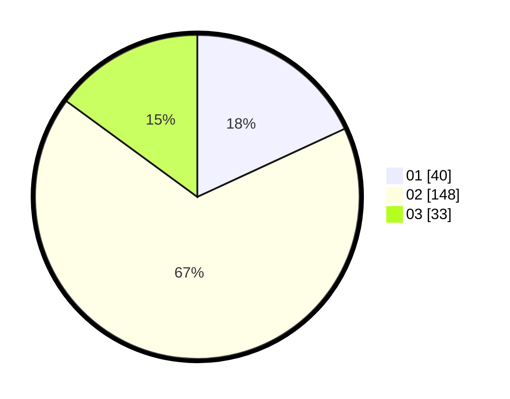

# Hasil

Hasil perolehan suara paslon dapat dilihat pada file paslon-01.txt, paslon-02.txt, dan paslon-03.txt.

Jika tidak ada, artinya data tersebut belum ada pada SIREKAP.

## Perolehan Suara

 * Paslon 01: **40**.
 * Paslon 02: **148**.
 * Paslon 03: **33**.

## Foto C Plano

https://sirekap-obj-formc.kpu.go.id/2dd3/pemilu/ppwp/31/01/02/10/03/3101021003006-20240214-193119--650ef15a-bc2c-49a4-9486-3972829a59f6.jpg

https://sirekap-obj-formc.kpu.go.id/2dd3/pemilu/ppwp/31/01/02/10/03/3101021003006-20240214-190224--47176b0f-a372-41ca-9122-cedcdfe0f7b1.jpg

https://sirekap-obj-formc.kpu.go.id/2dd3/pemilu/ppwp/31/01/02/10/03/3101021003006-20240214-190239--81d70a66-c9c9-4903-90e1-0ba24dd5e825.jpg

## DATA PEMILIH TETAP

Jumlah pemilih dalam DPT: **260**.
 * L: **137**.
 * P: **123**.

## DATA PENGGUNA HAK PILIH

Jumlah pengguna hak pilih dalam DPT: **221**.
 * L: **117**.
 * P: **104**.

Jumlah pengguna hak pilih dalam DPTb: **2**.
 * L: **0**.
 * P: **2**.

Jumlah pengguna hak pilih dalam DPK: **0**.
 * L: **0**.
 * P: **0**.

Jumlah pengguna hak pilih: **223**.
 * L: **117**.
 * P: **106**.

## JUMLAH SUARA SAH DAN TIDAK SAH

JUMLAH SELURUH SUARA SAH: **221**.

JUMLAH SUARA TIDAK SAH: **2**.

JUMLAH SELURUH SUARA SAH DAN SUARA TIDAK SAH: **223**.
