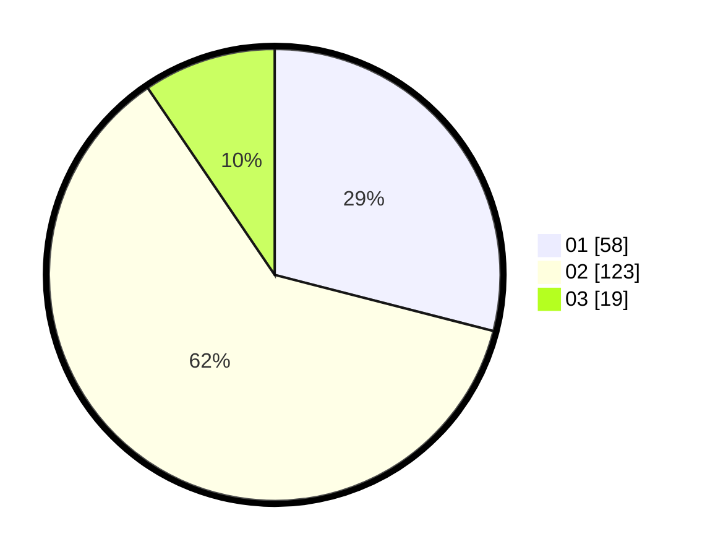

# Hasil

Hasil perolehan suara paslon dapat dilihat pada file paslon-01.txt, paslon-02.txt, dan paslon-03.txt.

Jika tidak ada, artinya data tersebut belum ada pada SIREKAP.

## Perolehan Suara

 * Paslon 01: **58**.
 * Paslon 02: **123**.
 * Paslon 03: **19**.

## Foto C Plano

https://sirekap-obj-formc.kpu.go.id/98fd/pemilu/ppwp/31/01/02/10/03/3101021003009-20240214-222809--43917542-3ed7-42b1-b2c6-f47fdf5270c0.jpg

https://sirekap-obj-formc.kpu.go.id/98fd/pemilu/ppwp/31/01/02/10/03/3101021003009-20240214-222904--ad309410-1a35-453a-b073-cf5e46c256f4.jpg

https://sirekap-obj-formc.kpu.go.id/98fd/pemilu/ppwp/31/01/02/10/03/3101021003009-20240214-222948--27668684-6802-481b-b69e-c8f39c446652.jpg
