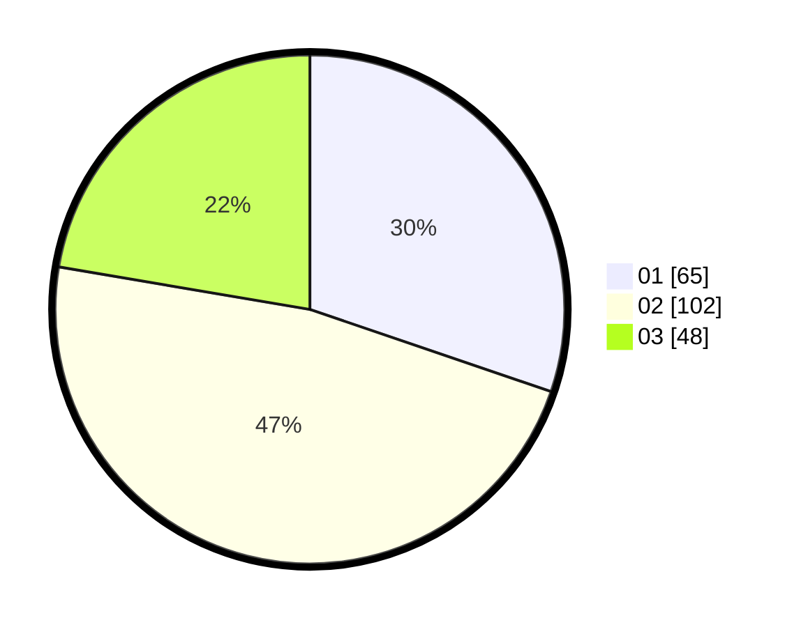

# Hasil

Hasil perolehan suara paslon dapat dilihat pada file paslon-01.txt, paslon-02.txt, dan paslon-03.txt.

Jika tidak ada, artinya data tersebut belum ada pada SIREKAP.

## Perolehan Suara

 * Paslon 01: **65**.
 * Paslon 02: **102**.
 * Paslon 03: **48**.

## Foto C Plano

https://sirekap-obj-formc.kpu.go.id/9f55/pemilu/ppwp/31/71/01/10/01/3171011001001-20240215-173025--b358330f-5873-48a1-997e-02adee640854.jpg

https://sirekap-obj-formc.kpu.go.id/9f55/pemilu/ppwp/31/71/01/10/01/3171011001001-20240215-173046--d899beb6-2be2-45d8-ae04-9e6331abb749.jpg

https://sirekap-obj-formc.kpu.go.id/9f55/pemilu/ppwp/31/71/01/10/01/3171011001001-20240215-173035--9d7a9603-b335-4c9d-baf8-dc8fd3759d5a.jpg

## DATA PEMILIH TETAP

Jumlah pemilih dalam DPT: **264**.
 * L: **130**.
 * P: **134**.

## DATA PENGGUNA HAK PILIH

Jumlah pengguna hak pilih dalam DPT: **199**.
 * L: **100**.
 * P: **99**.

Jumlah pengguna hak pilih dalam DPTb: **16**.
 * L: **9**.
 * P: **7**.

Jumlah pengguna hak pilih dalam DPK: **3**.
 * L: **2**.
 * P: **1**.

Jumlah pengguna hak pilih: **218**.
 * L: **111**.
 * P: **107**.

## JUMLAH SUARA SAH DAN TIDAK SAH

JUMLAH SELURUH SUARA SAH: **215**.

JUMLAH SUARA TIDAK SAH: **3**.

JUMLAH SELURUH SUARA SAH DAN SUARA TIDAK SAH: **218**.
