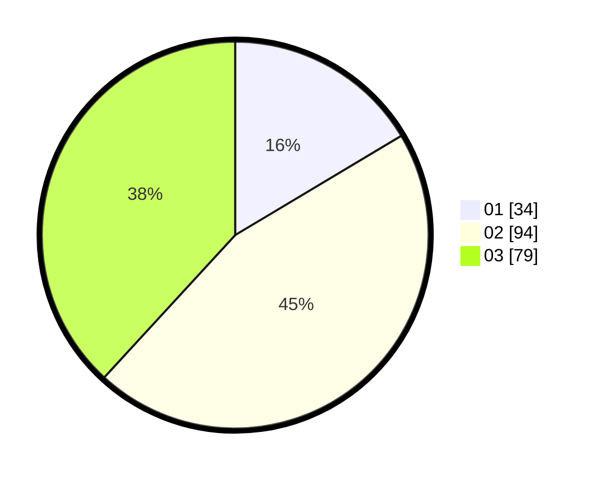

# Hasil

Hasil perolehan suara paslon dapat dilihat pada file paslon-01.txt, paslon-02.txt, dan paslon-03.txt.

Jika tidak ada, artinya data tersebut belum ada pada SIREKAP.

## Perolehan Suara

 * Paslon 01: **34**.
 * Paslon 02: **94**.
 * Paslon 03: **79**.

## Foto C Plano

https://sirekap-obj-formc.kpu.go.id/313f/pemilu/ppwp/31/71/01/10/01/3171011001003-20240216-142817--e0ca4850-c915-4d13-9eb1-72deb7e1e402.jpg

https://sirekap-obj-formc.kpu.go.id/313f/pemilu/ppwp/31/71/01/10/01/3171011001003-20240216-142818--70f205e9-e842-4eb1-a2d4-2a299748e371.jpg

https://sirekap-obj-formc.kpu.go.id/313f/pemilu/ppwp/31/71/01/10/01/3171011001003-20240216-142818--836d3aff-83d9-49f9-8986-7b431d8de947.jpg

## DATA PEMILIH TETAP

Jumlah pemilih dalam DPT: **188**.
 * L: **88**.
 * P: **100**.

## DATA PENGGUNA HAK PILIH

Jumlah pengguna hak pilih dalam DPT: **188**.
 * L: **88**.
 * P: **100**.

Jumlah pengguna hak pilih dalam DPTb: **20**.
 * L: **8**.
 * P: **12**.

Jumlah pengguna hak pilih dalam DPK: **2**.
 * L: **1**.
 * P: **1**.

Jumlah pengguna hak pilih: **210**.
 * L: **97**.
 * P: **113**.

## JUMLAH SUARA SAH DAN TIDAK SAH

JUMLAH SELURUH SUARA SAH: **207**.

JUMLAH SUARA TIDAK SAH: **3**.

JUMLAH SELURUH SUARA SAH DAN SUARA TIDAK SAH: **210**.
