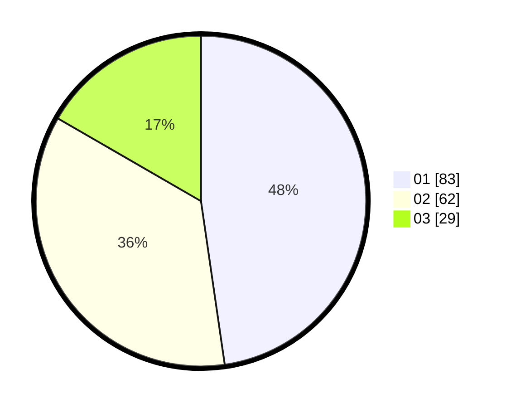

# Hasil

Hasil perolehan suara paslon dapat dilihat pada file paslon-01.txt, paslon-02.txt, dan paslon-03.txt.

Jika tidak ada, artinya data tersebut belum ada pada SIREKAP.

## Perolehan Suara

 * Paslon 01: **83**.
 * Paslon 02: **62**.
 * Paslon 03: **29**.

## Foto C Plano

https://sirekap-obj-formc.kpu.go.id/0db2/pemilu/ppwp/31/71/01/10/01/3171011001006-20240216-142431--386f8c51-03a3-4497-a67a-eb4903bb547b.jpg

https://sirekap-obj-formc.kpu.go.id/0db2/pemilu/ppwp/31/71/01/10/01/3171011001006-20240216-142433--b400256a-bfb9-4a42-a71c-d387f20e0ea7.jpg

https://sirekap-obj-formc.kpu.go.id/0db2/pemilu/ppwp/31/71/01/10/01/3171011001006-20240216-142432--08b8255b-a61f-439b-ae7a-328e12ad3db9.jpg

## DATA PEMILIH TETAP

Jumlah pemilih dalam DPT: **243**.
 * L: **133**.
 * P: **110**.

## DATA PENGGUNA HAK PILIH

Jumlah pengguna hak pilih dalam DPT: **163**.
 * L: **87**.
 * P: **76**.

Jumlah pengguna hak pilih dalam DPTb: **14**.
 * L: **6**.
 * P: **8**.

Jumlah pengguna hak pilih dalam DPK: **1**.
 * L: **1**.
 * P: **0**.

Jumlah pengguna hak pilih: **178**.
 * L: **94**.
 * P: **84**.

## JUMLAH SUARA SAH DAN TIDAK SAH

JUMLAH SELURUH SUARA SAH: **174**.

JUMLAH SUARA TIDAK SAH: **4**.

JUMLAH SELURUH SUARA SAH DAN SUARA TIDAK SAH: **178**.
