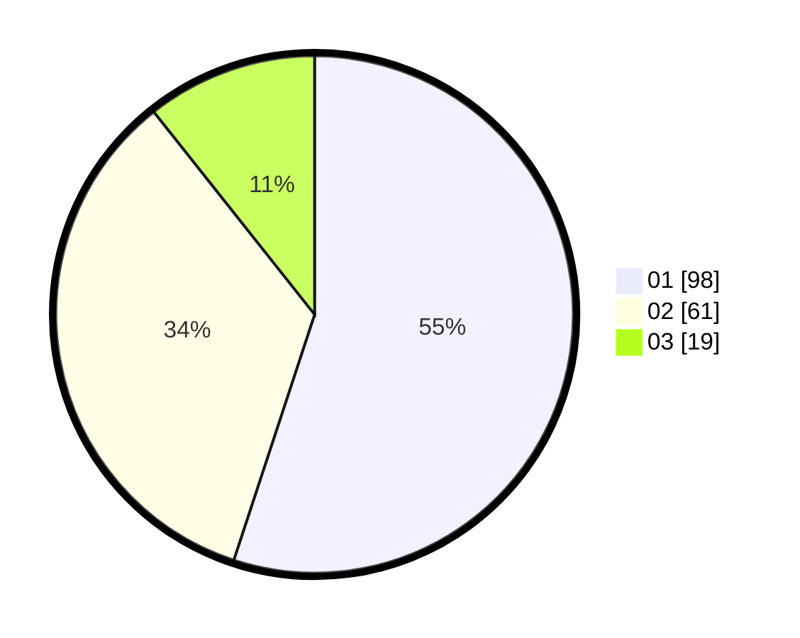

# Hasil

Hasil perolehan suara paslon dapat dilihat pada file paslon-01.txt, paslon-02.txt, dan paslon-03.txt.

Jika tidak ada, artinya data tersebut belum ada pada SIREKAP.

## Perolehan Suara

 * Paslon 01: **98**.
 * Paslon 02: **61**.
 * Paslon 03: **19**.

## Foto C Plano

https://sirekap-obj-formc.kpu.go.id/a837/pemilu/ppwp/31/71/01/10/01/3171011001007-20240216-144445--ee3c56cd-e1e7-4345-9817-3729c8fcbe4a.jpg

https://sirekap-obj-formc.kpu.go.id/a837/pemilu/ppwp/31/71/01/10/01/3171011001007-20240216-110749--fe0ef166-cd21-4f22-923c-cc60e79ace48.jpg

https://sirekap-obj-formc.kpu.go.id/a837/pemilu/ppwp/31/71/01/10/01/3171011001007-20240216-113936--43892af2-9ca0-438a-8b85-b1362ede03f3.jpg

## DATA PEMILIH TETAP

Jumlah pemilih dalam DPT: **214**.
 * L: **108**.
 * P: **106**.

## DATA PENGGUNA HAK PILIH

Jumlah pengguna hak pilih dalam DPT: **160**.
 * L: **79**.
 * P: **81**.

Jumlah pengguna hak pilih dalam DPTb: **17**.
 * L: **4**.
 * P: **13**.

Jumlah pengguna hak pilih dalam DPK: **2**.
 * L: **2**.
 * P: **0**.

Jumlah pengguna hak pilih: **179**.
 * L: **85**.
 * P: **94**.

## JUMLAH SUARA SAH DAN TIDAK SAH

JUMLAH SELURUH SUARA SAH: **178**.

JUMLAH SUARA TIDAK SAH: **1**.

JUMLAH SELURUH SUARA SAH DAN SUARA TIDAK SAH: **179**.
