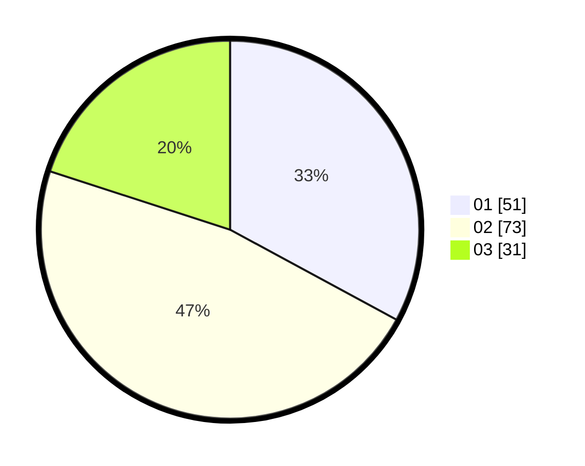

# Hasil

Hasil perolehan suara paslon dapat dilihat pada file paslon-01.txt, paslon-02.txt, dan paslon-03.txt.

Jika tidak ada, artinya data tersebut belum ada pada SIREKAP.

## Perolehan Suara

 * Paslon 01: **51**.
 * Paslon 02: **73**.
 * Paslon 03: **31**.

## Foto C Plano

https://sirekap-obj-formc.kpu.go.id/ed85/pemilu/ppwp/31/71/01/10/01/3171011001009-20240216-023032--2a4ee853-2936-41b7-a339-0f1790b0c720.jpg

https://sirekap-obj-formc.kpu.go.id/ed85/pemilu/ppwp/31/71/01/10/01/3171011001009-20240216-023034--8cd562f4-ddc4-4eda-9236-efe84c471470.jpg

https://sirekap-obj-formc.kpu.go.id/ed85/pemilu/ppwp/31/71/01/10/01/3171011001009-20240216-023034--e22977fa-7c64-42bc-b337-624381376585.jpg

## DATA PEMILIH TETAP

Jumlah pemilih dalam DPT: **191**.
 * L: **97**.
 * P: **94**.

## DATA PENGGUNA HAK PILIH

Jumlah pengguna hak pilih dalam DPT: **130**.
 * L: **64**.
 * P: **66**.

Jumlah pengguna hak pilih dalam DPTb: **17**.
 * L: **8**.
 * P: **9**.

Jumlah pengguna hak pilih dalam DPK: **8**.
 * L: **4**.
 * P: **4**.

Jumlah pengguna hak pilih: **155**.
 * L: **76**.
 * P: **79**.

## JUMLAH SUARA SAH DAN TIDAK SAH

JUMLAH SELURUH SUARA SAH: **155**.

JUMLAH SUARA TIDAK SAH: **0**.

JUMLAH SELURUH SUARA SAH DAN SUARA TIDAK SAH: **155**.
