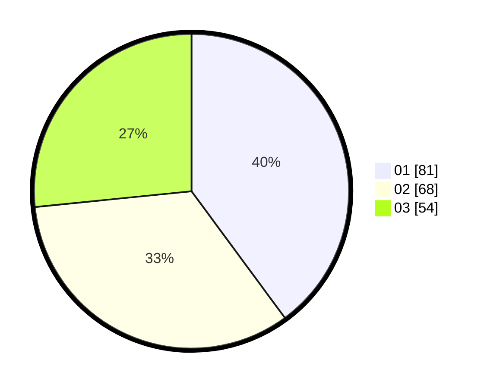

# Hasil

Hasil perolehan suara paslon dapat dilihat pada file paslon-01.txt, paslon-02.txt, dan paslon-03.txt.

Jika tidak ada, artinya data tersebut belum ada pada SIREKAP.

## Perolehan Suara

 * Paslon 01: **81**.
 * Paslon 02: **68**.
 * Paslon 03: **54**.

## Foto C Plano

https://sirekap-obj-formc.kpu.go.id/e7ca/pemilu/ppwp/31/71/01/10/02/3171011002001-20240215-204510--8a2f3fa4-4d7c-43c6-8481-a4a5ec25e28e.jpg

https://sirekap-obj-formc.kpu.go.id/e7ca/pemilu/ppwp/31/71/01/10/02/3171011002001-20240215-204513--ec8c5d0c-89f0-4b6a-a999-5ff9d6af0f3b.jpg

https://sirekap-obj-formc.kpu.go.id/e7ca/pemilu/ppwp/31/71/01/10/02/3171011002001-20240215-204511--a740dead-0bd9-4c87-ae70-da12c4884a16.jpg

## DATA PEMILIH TETAP

Jumlah pemilih dalam DPT: **245**.
 * L: **118**.
 * P: **127**.

## DATA PENGGUNA HAK PILIH

Jumlah pengguna hak pilih dalam DPT: **192**.
 * L: **88**.
 * P: **104**.

Jumlah pengguna hak pilih dalam DPTb: **15**.
 * L: **9**.
 * P: **6**.

Jumlah pengguna hak pilih dalam DPK: **1**.
 * L: **1**.
 * P: **0**.

Jumlah pengguna hak pilih: **208**.
 * L: **98**.
 * P: **110**.

## JUMLAH SUARA SAH DAN TIDAK SAH

JUMLAH SELURUH SUARA SAH: **203**.

JUMLAH SUARA TIDAK SAH: **5**.

JUMLAH SELURUH SUARA SAH DAN SUARA TIDAK SAH: **208**.
