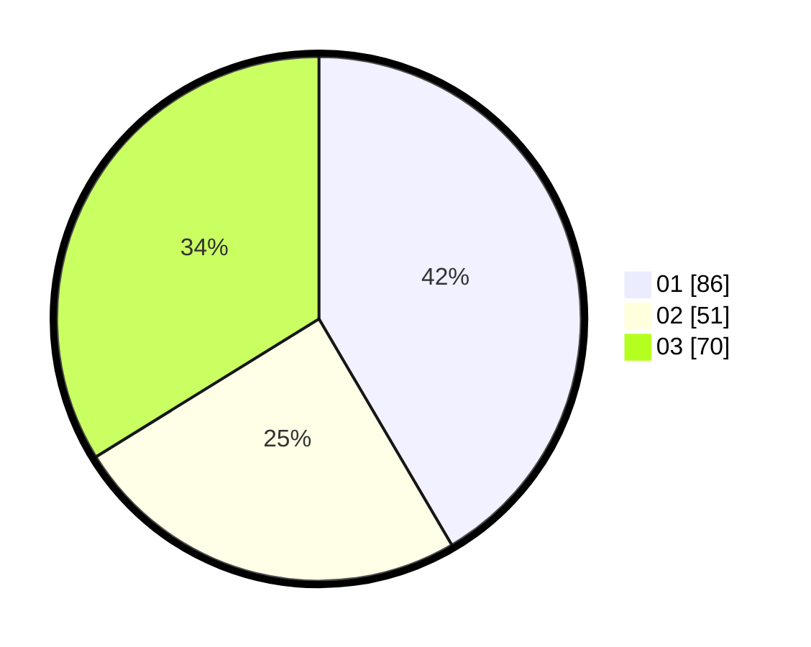

# Hasil

Hasil perolehan suara paslon dapat dilihat pada file paslon-01.txt, paslon-02.txt, dan paslon-03.txt.

Jika tidak ada, artinya data tersebut belum ada pada SIREKAP.

## Perolehan Suara

 * Paslon 01: **86**.
 * Paslon 02: **51**.
 * Paslon 03: **70**.

## Foto C Plano

https://sirekap-obj-formc.kpu.go.id/ebad/pemilu/ppwp/31/71/01/10/02/3171011002003-20240216-031435--ad5098f6-486f-425a-9187-84460b8e78da.jpg

https://sirekap-obj-formc.kpu.go.id/ebad/pemilu/ppwp/31/71/01/10/02/3171011002003-20240216-031436--8f34ce1d-91b9-4628-8304-912acfe7c33b.jpg

https://sirekap-obj-formc.kpu.go.id/ebad/pemilu/ppwp/31/71/01/10/02/3171011002003-20240216-031435--5b9966f4-8ee8-4ae1-bb53-02869d08d056.jpg

## DATA PEMILIH TETAP

Jumlah pemilih dalam DPT: **247**.
 * L: **121**.
 * P: **126**.

## DATA PENGGUNA HAK PILIH

Jumlah pengguna hak pilih dalam DPT: **196**.
 * L: **97**.
 * P: **99**.

Jumlah pengguna hak pilih dalam DPTb: **13**.
 * L: **1**.
 * P: **12**.

Jumlah pengguna hak pilih dalam DPK: **1**.
 * L: **1**.
 * P: **0**.

Jumlah pengguna hak pilih: **210**.
 * L: **99**.
 * P: **111**.

## JUMLAH SUARA SAH DAN TIDAK SAH

JUMLAH SELURUH SUARA SAH: **207**.

JUMLAH SUARA TIDAK SAH: **3**.

JUMLAH SELURUH SUARA SAH DAN SUARA TIDAK SAH: **210**.
