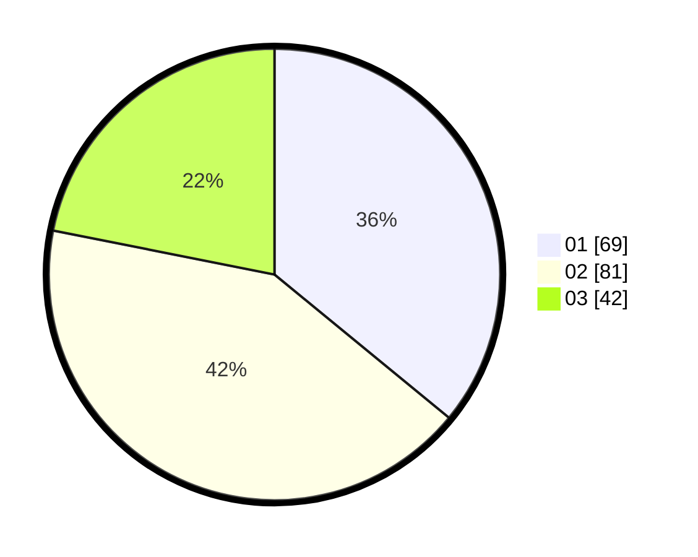

# Hasil

Hasil perolehan suara paslon dapat dilihat pada file paslon-01.txt, paslon-02.txt, dan paslon-03.txt.

Jika tidak ada, artinya data tersebut belum ada pada SIREKAP.

## Perolehan Suara

 * Paslon 01: **69**.
 * Paslon 02: **81**.
 * Paslon 03: **42**.

## Foto C Plano

https://sirekap-obj-formc.kpu.go.id/b9c3/pemilu/ppwp/31/71/01/10/02/3171011002006-20240214-185352--9137004d-dcd1-4c58-b022-e84a30c597bb.jpg

https://sirekap-obj-formc.kpu.go.id/b9c3/pemilu/ppwp/31/71/01/10/02/3171011002006-20240214-155116--9eb3e9c5-1cde-452c-a6e2-04fa5083942f.jpg

https://sirekap-obj-formc.kpu.go.id/b9c3/pemilu/ppwp/31/71/01/10/02/3171011002006-20240214-155159--b290b04c-b1ae-457e-a5a9-7a15fda5d3e9.jpg

## DATA PEMILIH TETAP

Jumlah pemilih dalam DPT: **244**.
 * L: **123**.
 * P: **121**.

## DATA PENGGUNA HAK PILIH

Jumlah pengguna hak pilih dalam DPT: **178**.
 * L: **87**.
 * P: **91**.

Jumlah pengguna hak pilih dalam DPTb: **17**.
 * L: **0**.
 * P: **17**.

Jumlah pengguna hak pilih dalam DPK: **1**.
 * L: **1**.
 * P: **0**.

Jumlah pengguna hak pilih: **196**.
 * L: **88**.
 * P: **108**.

## JUMLAH SUARA SAH DAN TIDAK SAH

JUMLAH SELURUH SUARA SAH: **192**.

JUMLAH SUARA TIDAK SAH: **4**.

JUMLAH SELURUH SUARA SAH DAN SUARA TIDAK SAH: **196**.
