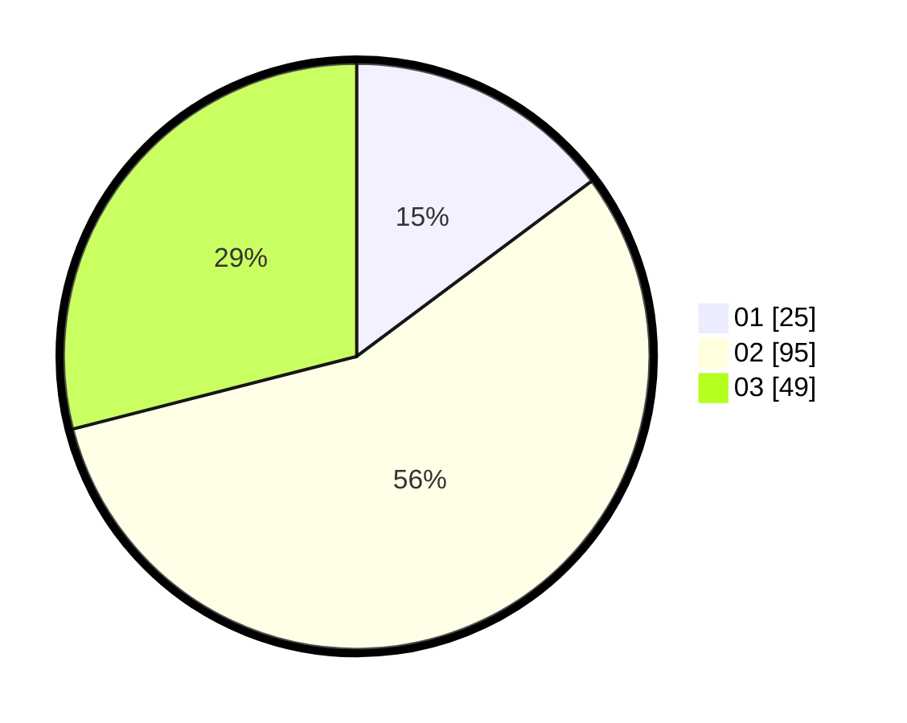

# Hasil

Hasil perolehan suara paslon dapat dilihat pada file paslon-01.txt, paslon-02.txt, dan paslon-03.txt.

Jika tidak ada, artinya data tersebut belum ada pada SIREKAP.

## Perolehan Suara

 * Paslon 01: **25**.
 * Paslon 02: **95**.
 * Paslon 03: **49**.

## Foto C Plano

https://sirekap-obj-formc.kpu.go.id/48ec/pemilu/ppwp/31/71/01/10/02/3171011002010-20240216-165335--406d9bbb-b342-4775-909d-a06e7a3e76b5.jpg

https://sirekap-obj-formc.kpu.go.id/48ec/pemilu/ppwp/31/71/01/10/02/3171011002010-20240216-165337--f1543f70-4fbf-4458-a8a5-52c2fbfc31ad.jpg

https://sirekap-obj-formc.kpu.go.id/48ec/pemilu/ppwp/31/71/01/10/02/3171011002010-20240216-165336--c12f1255-389a-4b54-be9e-266eb165cecc.jpg

## DATA PEMILIH TETAP

Jumlah pemilih dalam DPT: **204**.
 * L: **96**.
 * P: **108**.

## DATA PENGGUNA HAK PILIH

Jumlah pengguna hak pilih dalam DPT: **153**.
 * L: **72**.
 * P: **81**.

Jumlah pengguna hak pilih dalam DPTb: **18**.
 * L: **7**.
 * P: **11**.

Jumlah pengguna hak pilih dalam DPK: **1**.
 * L: **0**.
 * P: **1**.

Jumlah pengguna hak pilih: **172**.
 * L: **79**.
 * P: **93**.

## JUMLAH SUARA SAH DAN TIDAK SAH

JUMLAH SELURUH SUARA SAH: **169**.

JUMLAH SUARA TIDAK SAH: **3**.

JUMLAH SELURUH SUARA SAH DAN SUARA TIDAK SAH: **172**.
